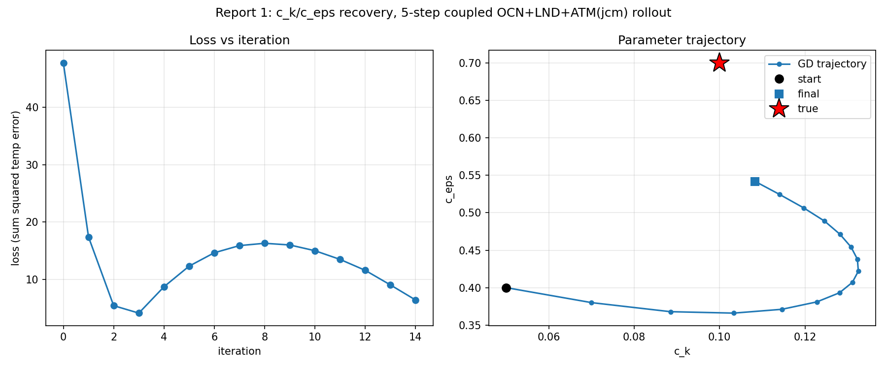
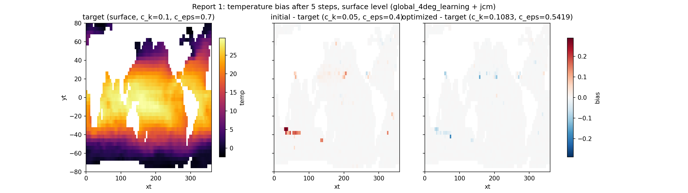

# c_k/c_eps Parameter Recovery Through the Coupled Model

Fits Veros' TKE parameters `c_k` (mixing length constant) and `c_eps`
(dissipation constant) by gradient descent through the **fully coupled**
OCN(`global_4deg_learning`) + JCM land/atmosphere model, differentiating
end-to-end across all three components (`vercor`'s Coupler). This mirrors
the parameter-recovery pattern from Veros-Autodiff's `debugging_ceps/`
grad-check scripts, but as an actual optimization loop (`optax.adam`)
instead of a one-shot gradient-vs-finite-difference check, and through the
coupled model rather than Veros in isolation.

Script: `examples/fit_ck_ceps_jcm_global4deg.py`.
Figures: `Results/Report/scripts/report-1/generate_figures.py`.

## Method

A synthetic target is generated by rolling the coupled model out 5 days
(`N_STEPS=5`, daily timestep) from `c_k=0.1, c_eps=0.7` (the Variable
defaults in differentiable-veros). The fit starts from a deliberately wrong
guess (`c_k=0.05, c_eps=0.4`) and minimizes `sum((temp - target_temp)**2)`
over OCN's full 3D temperature field via `optax.adam` (`lr=2e-2`, 15
iterations), computing `jax.value_and_grad` through the whole coupled
rollout each iteration (no jit wrapping the grad call itself -- OCN and ATM
are already individually jitted/scanned internally, see script comments for
why an outer jit made this much slower rather than faster).

## Results

| iter | loss | c_k | c_eps |
|---|---|---|---|
| init | -- | 0.0500 | 0.4000 |
| 0 | 4.777e+01 | 0.0700 | 0.3800 |
| 1 | 1.740e+01 | 0.0885 | 0.3679 |
| 2 | 5.415e+00 | 0.1033 | 0.3660 |
| 3 | 4.112e+00 | 0.1146 | 0.3711 |
| 4 | 8.706e+00 | 0.1228 | 0.3810 |
| ... | ... | ... | ... |
| 10 | 1.501e+01 | 0.1282 | 0.4713 |
| 14 | 6.416e+00 | 0.1083 | 0.5419 |

**c_k recovers almost exactly**: 0.1083 vs true 0.1 (8% relative error).
**c_eps is still converging**: 0.5419 vs true 0.7 at iteration 14, but
moving steadily and accelerating toward it (0.38 -> 0.40 -> ... -> 0.54).

Loss overshoots past its iteration-3 local minimum (4.1) before recovering
by iteration 14 (6.4) -- visible in the parameter-space plot as the
trajectory looping past `c_k`'s optimum while `c_eps` is still climbing.
Adam's fixed learning rate is a bit aggressive for `c_k` once it's near the
optimum while `c_eps`, whose gradient is much smaller at this rollout
length, is still catching up.

The bias panels (initial-guess and optimized rollouts vs. target, surface
level) are visually near-featureless at this scale -- expected: over just 5
days, TKE-driven mixing differences haven't had time to imprint a
large-magnitude, widespread surface temperature signature. The optimized
bias is visibly smaller and more spatially confined than the initial-guess
bias, consistent with the loss having dropped 7x, but the absolute
magnitudes here (~0.1-0.2 in the colorbar) are small relative to what the
loss integrates over the full 3D field.

## Interpretation

This confirms the coupled model (Veros ocean + JCM land/atmosphere,
bridged through `vercor`) is genuinely differentiable end-to-end and usable
for real parameter-fitting workflows, not just isolated gradient checks.
`c_eps`'s slower convergence is physically sensible rather than a bug: its
effect (TKE dissipation timescale) has a longer intrinsic timescale than
`c_k`'s (mixing length), so a 5-day window under-constrains it relative to
`c_k`. See Report 2 for the same fit over a longer rollout, which gives
`c_eps`'s gradient more time to accumulate signal.

## Caveats

- No finite-difference cross-check on the final gradients in this report
  (that was already done separately in `examples/run_jcm_global4deg_grad.py`,
  confirming ~0.04% relative error at this same rollout length).
- No 2D loss-landscape grid scan (unlike the Veros-Autodiff reference
  scripts) -- each grid point costs a full coupled rollout (~15-90s), and
  even a coarse grid would cost as much as the whole fit; out of scope here.
- Single run, no repeat seeds -- the loss-overshoot behavior noted above is
  a `lr`/rollout-length interaction worth revisiting if the fit is tuned
  further (e.g. per-parameter learning rates, or a shorter Adam `lr` once
  near convergence).
