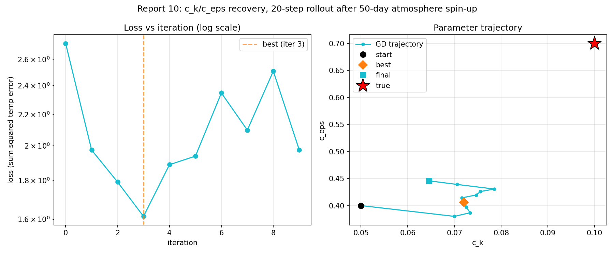
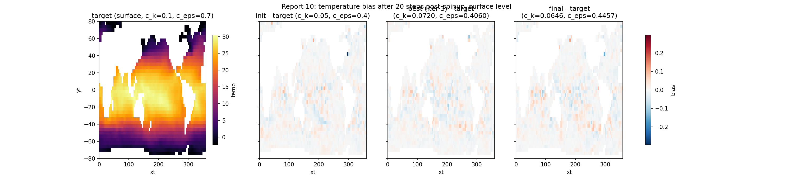

# Report 10: Calibration After Atmosphere Spin-Up

Tests whether starting the n=20 gradient window after the atmosphere's initial transient (report-9: JCM's domain-mean forcing stabilizes after ~50-150 days) improves gradient trustworthiness, compared to report-3's cold-start n=20 result (7.3% FD rel error) and report-8's cold-start fit.

Script: `Results/Report/scripts/report-10/spinup_then_calibrate.py`.

## Setup

- 50-day forward-only spin-up from the standard initial state (no grad, cheap).
- From the spun-up state: same recipe as report-3's FD check and report-8's fit -- N_STEPS=20, true c_k=0.1/c_eps=0.7, init c_k=0.05/c_eps=0.4, adam + cosine-decay lr (peak 2e-2), N_ITERS=30 with early stop (patience=6, rel tol 5e-3).

## Result 1: FD-vs-AD spot check at n=20, post-spinup

| | value |
|---|---|
| AD grad | -1.4937e+03 |
| FD grad (eps=1e-2) | -1.1930e+04 |
| rel err | 87.5% |
| report-3 cold-start n=20 reference | 7.3% |

Gradient trustworthiness is worse after spin-up, not better -- 87.5% rel error vs 7.3% cold-start, at the identical window length (n=20).

## Result 2: fit from the spun-up state

| iter | loss | c_k | c_eps |
|---|---|---|---|
| init | -- | 0.0500 | 0.4000 |
| 0 | 2.726 | 0.0700 | 0.3800 |
| 3 | 1.614 | 0.0720 | 0.4060 |
| 6 | 2.346 | 0.0756 | 0.4260 |
| 8 | 2.507 | 0.0785 | 0.4306 |
| 9 | 1.974 | 0.0646 | 0.4457 |

Early stop at iteration 9 (patience). Best: iteration 3, loss=1.614, c_k=0.0720 (28% error), c_eps=0.4060 (42% error). Final: c_k=0.0646, c_eps=0.4457.

Loss oscillates (down-up-down-up) rather than monotonically decaying. The parameter trajectory stays clustered near (0.07-0.08, 0.38-0.45) for all 10 iterations, never approaching the true point (0.1, 0.7).

## Comparison to report-8 (cold start, same N_STEPS/N_ITERS/optimizer)

| | report-8 (cold start) | report-10 (post-50-day spinup) |
|---|---|---|
| initial loss | 46.3 | 2.73 |
| best loss | 0.877 (iter 17) | 1.614 (iter 3) |
| best c_k error | 4.1% | 28% |
| best c_eps error | 14.1% | 42% |
| run length | 20 iterations (no early stop) | 9 iterations (early stop) |

Initial loss scale differs (different absolute temperature-field variance after 50 days of evolution vs day 0) so the two loss columns aren't directly comparable, but the relative pattern is: report-8 reduces loss >98% and gets c_k within 4%; report-10 reduces loss ~41% at best and never gets c_k below 28% error.

## Interpretation

The hypothesis (spin-up stabilizes the gradient) does not hold -- it's the opposite. Report-3's original cold-start n=20 window benefits from starting at a quiescent atmosphere state where chaotic forcing amplitude hasn't ramped up yet (report-9's wind stress curve: near 0 at day 0, climbing over the first ~50-90 days). A 50-day-post-spinup n=20 window instead starts already inside the fully turbulent regime, so the same window length is no longer within the trustworthy horizon. The n<=20 trustworthy-gradient result from report-3 is specific to a cold start, not a general property of "any 20-day window."

## Caveats

Single run, single spin-up length (50 days) and single seed. Loss-scale difference between the two starting points (day 0 vs day 50) means the loss-value comparison to report-8 is qualitative, not a controlled apples-to-apples magnitude comparison. Only one FD spot check (n=20) run post-spinup -- a bracket across several n values (as report-3 did cold-start) was not repeated here.
