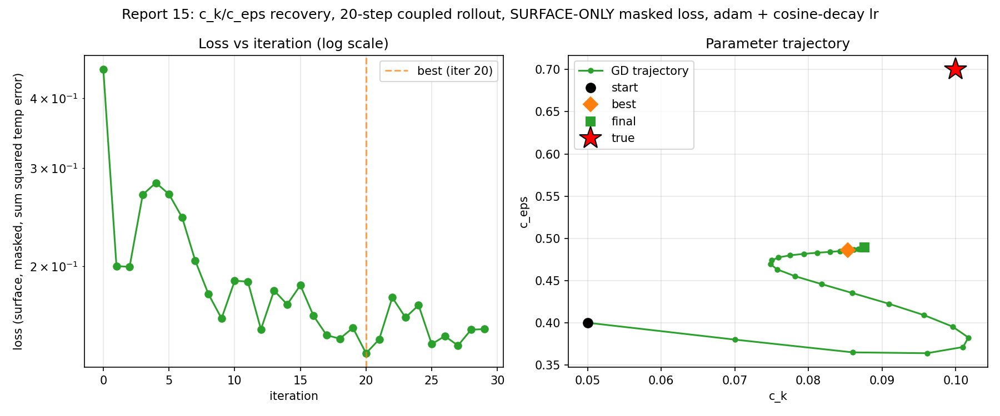
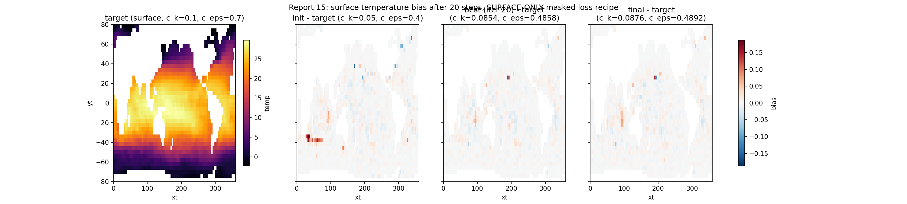
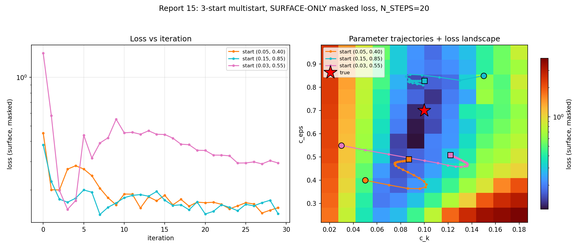

# Report 15: Surface-Only Masked Loss

Same recipe as [report-8](report-8-ck-ceps-coupled-fit-n20-classical.md)'s classical single-run fit (`optax.adam` + cosine-decay lr, N_ITERS=30, N_STEPS=20, start `c_k=0.05, c_eps=0.4`) with one change: the loss now sums squared temperature error over the **ocean surface level only, masked to valid ocean cells** (2319 of 3600 surface grid cells), instead of the full unmasked 3D temperature field.

Motivation: `c_k`/`c_eps` are TKE mixing-length/dissipation params that hit the surface mixed layer hardest and fastest — within a 20-day rollout the deeper levels have barely responded, so summing over the whole column dilutes the gradient signal with mostly-unresponsive (low-signal) deep cells. Separately, report-8's loss summed over the *raw unmasked* temp array — only its plotting code masked land via `maskT` — so every prior report-8/9 run's gradient was carrying whatever land cells contain as extra noise, for free to remove.

Script: `Results/Report/scripts/report-15/fit_and_generate_figures.py`.

## Setup

- N_STEPS=20, N_ITERS=30, lr=2e-2 (cosine decay to 0)
- True: c_k=0.1, c_eps=0.7; Init: c_k=0.05, c_eps=0.4 (same start as report-8's classical run)
- Loss: `sum((temp - target_temp)^2)` over the surface level only, masked to ocean cells (land cells excluded via `maskT`)

## Results

| | c_k | c_eps | loss |
|---|---|---|---|
| init | 0.0500 | 0.4000 | -- |
| best (iter 20) | 0.0854 | 0.4858 | 0.1397 |
| final (iter 29) | 0.0876 | 0.4892 | 0.1543 |

Loss magnitudes here aren't directly comparable to report-8's (different summation domain: ~2319 surface cells here vs. the full unmasked 3D column there), but the *shape* of the loss trajectory is the point of this experiment, and it's real: loss ranges only 3.2x (0.140 to 0.451) across all 30 iterations here, vs. 44.5x (1.04 to 46.3) for the same start/schedule/iteration-count run against the full-column loss in report-8's landscape addendum. The wild early-iteration swings (loss jumping ~50x within a handful of steps) are gone -- there's still a small overshoot hump (iterations 3-6, up to ~2x the eventual best) but nothing like the old recipe's chaos.

`c_k` also converges cleanly to near its true value (0.085 vs true 0.1, 15% error) with a tight, well-behaved spiral in parameter space (see the trajectory plot's right panel) rather than the wide loops seen in report-8's multistart trajectories.

## What didn't improve: `c_eps` identifiability

`c_eps` still stalls at ~0.49, far short of the true 0.7 (30% error) -- similar magnitude of error to report-8's runs from the same start. The cleaner loss surface made the *optimization* well-behaved (smooth descent, no chaotic overshoot, `c_k` locks on tightly), but did not fix the underlying *identifiability* problem: `c_eps`'s effect on the 20-day surface temperature field is apparently still too weak/degenerate to pin down from a temperature-only loss, masked-surface-only or not. This confirms the identifiability issue found in report-8's loss-landscape grid scan (wide, flat low-loss band in `c_eps`) is structural to the *information available in a 20-step temperature loss*, not an artifact of loss noise or land-cell contamination that a cleaner loss definition could paper over.

## Takeaway

Surface-only + masked loss is a clear, free win for optimization *cleanliness* (smaller relative loss swings, no chaotic hump, `c_k` converges tightly) -- worth adopting as the default recipe for any further N_STEPS=20 fits. It is not a fix for `c_eps` identifiability, which would need either a different observable (e.g. a `c_eps`-sensitive diagnostic beyond surface temperature) or a longer rollout (previously found unstable, not revisited here).

## Multistart: where do different initializations land?

Same 3 starting points as report-8's `landscape_multistart.py` ((0.05, 0.40), (0.15, 0.85), (0.03, 0.55)), re-optimized here with report-15's surface-only masked loss, same cosine-decay recipe (N_ITERS=30). Includes the 12x12 forward-only grid scan (same c_k/c_eps ranges as report-8's) as a landscape backdrop -- initially skipped pending a cost estimate, then added once actual timing showed each forward-only surface-loss eval takes ~25s (measured directly, not scaled from the value_and_grad timing), so the full 144-point grid costs roughly 1 hour, not the several hours a naive scaling estimate suggested.

Script: `Results/Report/scripts/report-15/landscape_multistart.py`.

| start (c_k, c_eps) | best iter | best (c_k, c_eps, loss) | end (c_k, c_eps, loss) | c_eps drift from init |
|---|---|---|---|---|
| (0.05, 0.40) | 27 | (0.0870, 0.4894, 0.1436) | (0.0870, 0.4895, 0.1549) | +0.090 (22% relative) |
| (0.15, 0.85) | 7 | (0.0988, 0.8096, 0.1406) | (0.1002, 0.8273, 0.1420) | -0.023 (3% relative) |
| (0.03, 0.55) | 3 | (0.1002, 0.4845, 0.1513) | (0.1221, 0.5078, 0.2936) | -0.042 (8% relative) |

Confirms and sharpens the single-start finding: `c_k` converges toward true (0.1) from every start (end error 0.2%, 13%, and 22% respectively -- the (0.15, 0.85) start actually lands almost exactly on it), but `c_eps` barely moves from wherever each run started -- it stays within 3-22% of its own *initial* value in every case, never approaching the true 0.7 from any direction. The three final `c_eps` values (0.49, 0.83, 0.51) are close to their own starts (0.40, 0.85, 0.55) and nowhere near each other or near truth, which is the signature of a genuinely flat/uninformative gradient direction rather than three different local minima -- if it were local minima you'd expect the three ends to cluster somewhere consistent across starts. Same conclusion as before, now confirmed independent of starting point: a 20-day surface temperature loss, however cleanly optimized, does not carry enough information to identify `c_eps`.

The grid scan makes this visually explicit: global min loss is 0.112 at (c_k=0.093, c_eps=0.568), and at that best `c_k` column, loss stays under 0.2 for `c_eps` all the way from 0.44 to 0.82 -- more than a third of the scanned range, at essentially the same loss. `c_k` has real structure (loss varies up to ~35x across the scanned range, and the loss ratio between the best and worst `c_eps` at a fixed `c_k` grows sharply away from the optimal `c_k` column -- 1.4x at c_k=0.02, up to 11x at c_k=0.136), while `c_eps` is comparatively shallow near the optimum -- exactly why every optimization run's `c_k` locks on tightly while `c_eps` drifts to wherever gradient noise happens to leave it.
