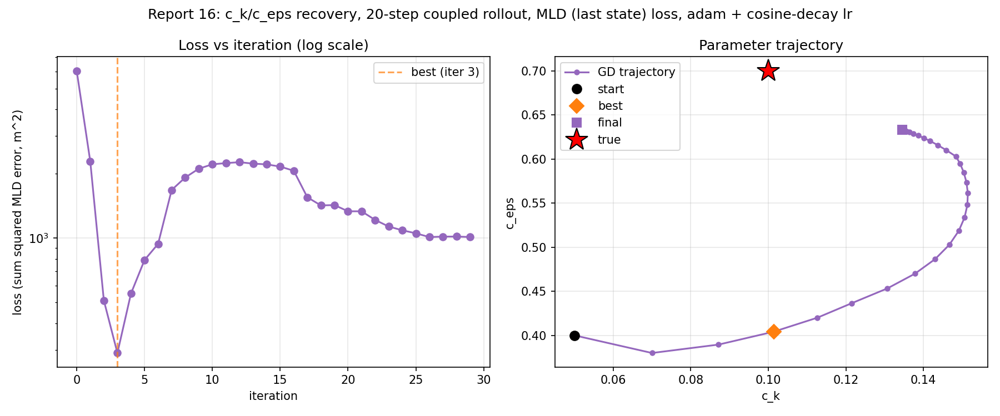
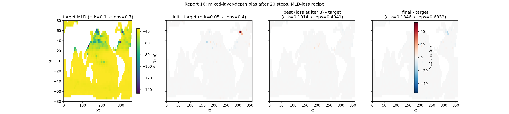

# Report 16: Mixed-Layer-Depth Loss

Same recipe as [report-15](report-15-surface-only-masked-loss.md) (`optax.adam` + cosine-decay lr, N_ITERS=30, N_STEPS=20, start `c_k=0.05, c_eps=0.4`) with one change: the observable. The loss is now the sum of squared error on the **mixed layer depth diagnosed from the final state** — not on temperature.

Motivation: MLD is the diagnostic `c_k`/`c_eps` act on most directly. Surface temperature only sees the TKE mixing indirectly, through the heat that mixing redistributes; MLD is read straight off the density profile the mixing shapes. Report-15 showed that a cleaner *temperature* loss fixes optimization behaviour but not `c_eps` identifiability, and concluded that a different observable would be needed. This is that experiment.

The MLD kernel is the `get_index_mld` / `mld_from_index` split from the Veros-Autodiff checkout's `setups/global_4deg/global_4deg_mld_learning.py`, gradient-validated there in [report-mld-2](../../../Veros-Autodiff/Results/Report/report-mld-2.md). It is ported here to run on the final coupled-run payload instead of inside `after_timestep`. Unlike report-mld-2's fitting target, this uses the **instantaneous MLD of the last state** — no `mld_ma` moving average, no circular buffer.

Script: `Results/Report/scripts/report-16/fit_and_generate_figures.py`.

## Setup

- N_STEPS=20, N_ITERS=30, lr=2e-2 (cosine decay to 0)
- True: c_k=0.1, c_eps=0.7; Init: c_k=0.05, c_eps=0.4 (same start as report-15)
- Loss: `sum((mld - target_mld)^2)` over ocean columns with a well-defined MLD in the target run
- MLD definition: depth where potential density first exceeds `prho(reference level) + 0.03 kg/m^3`, linearly interpolated between the two levels bracketing that crossing
- On this grid (nz=15, top cell 50 m thick, `zt[-1] = -35 m`) the reference level *is* the surface level, since every cell centre is deeper than the -10 m reference depth
- 2312 of 2319 surface ocean columns have a well-defined MLD (3600 total surface cells); 1 column loses its definition at the best/final parameters, so the loss domain is effectively constant across the run

## Results

| | c_k | c_eps | loss (m^2) | MLD RMSE (m) |
|---|---|---|---|---|
| init | 0.0500 | 0.4000 | 6046.4 | 1.617 |
| lowest loss (evaluated at iter 3) | 0.1014 | 0.4041 | 290.5 | 0.355 |
| final (after iter 29) | 0.1346 | 0.6332 | 1007.2 | 0.660 |

Wall time: 4145 s for 30 iterations (mean 138 s/iter), CPU.

### `c_eps` identifiability improves substantially

This is the headline. `c_eps` reaches 0.633 against a true 0.7 (9.5% error), versus 0.489 (30% error) for report-15's surface-temperature loss from the identical start and schedule. Its trajectory is monotone from iteration 1 onward and was still climbing when the cosine-decayed lr ran out — the run stopped short of convergence rather than stalling on a flat band. `dL/dc_eps` stays consistently negative (pushing `c_eps` up toward the truth) from iteration 1 to the end, where report-8's landscape scan found a wide, flat, uninformative band in `c_eps` for temperature losses.

So the identifiability problem report-15 diagnosed as structural to "a 20-step temperature loss" really was about the *observable*, not about the rollout length: 20 days is enough to constrain `c_eps` when you look at MLD.

One caveat on the signal's onset: in the N_STEPS=2 smoke test, `dL/dc_eps` was **exactly** 0.0 while `dL/dc_k` was large. The `c_eps` signal in MLD needs more than a couple of days to appear at all; it is not present from step one.

### `c_k` gets worse, and the optimization is rougher

`c_k` ends at 0.1346 (35% high) versus report-15's 0.0876 (12% low). The loss curve is not a clean descent: it drops 20x over the first three iterations (6046 to 290), then climbs back 7.6x to a plateau near 2.2e3 across iterations 8-16 while `c_k` overshoots to 0.151, then partially recovers as the lr decays, ending at 1007 — 3.5x above the best value seen. At iteration 29 `dL/dc_k` is still +4.3e4, i.e. still asking for a smaller `c_k`; the run ended because the schedule ran out, not because it converged.

Loss ranges 20.8x (290 to 6046) across the run, against 3.2x for report-15's surface-temperature loss and 44.5x for report-8's full-column loss. So on optimization cleanliness this sits between the two.

Gradient magnitudes differ by two to three orders: `dL/dc_k` ~ 1e4-1e5, `dL/dc_eps` ~ 1e2-1e3. Adam's per-parameter normalization is what makes both move at comparable rates in parameter space — a plain SGD step on this loss would move `c_k` only.

### The loss is dominated by a handful of columns

This is the structural caveat, and it explains the roughness. Of the 2312 columns in the loss:

| | cells with \|bias\| > 0.1 m | top-1 cell's share of loss | top-5 cells' share |
|---|---|---|---|
| init | 196 | 48% | 88% |
| best | 175 | 19% | 68% |
| final | 169 | 27% | 74% |

Field-wide MLD RMSE is 0.36-1.6 m against MLD depths averaging -38.7 m — under 5% error even at the initial guess. Nearly the entire loss comes from a few dozen columns where the *discrete* level pair bracketing the density crossing differs between the candidate and the target run; when that pair flips, MLD jumps by up to a level thickness (50-110 m on this grid). The bias maps show exactly this: a nearly blank field with a few isolated extreme cells (up to 54 m at init, in the North Pacific / high-latitude North Atlantic).

That makes the MLD loss piecewise-smooth with jumps at the flip boundaries. Within a piece the gradient is well-defined and correct — `get_index_mld`'s index selection is zero-gradient by construction, so no NaN or sentinel ever reaches a differentiated primitive — but it carries no information about the jumps, which is where most of the loss lives. Hence the sign flips in `dL/dc_k` (iterations 3, 5, 6) and the fact that the run ends above its own best.

The coarse vertical grid makes this worse than it needs to be: 98% of target MLD values are shallower than -65 m, i.e. interpolated between just the top two cell centres (-35 m and -65 m). MLD is being resolved by two levels.

## Note on the "best iteration" bookkeeping

The optimizer loop records the loss evaluated *before* an iteration's update alongside the parameters produced *after* it. Paired naively, the row labelled "best" names parameters one adam step past the ones that were actually scored. Verified here: the init parameters reproduce row 0's loss (6046.4) exactly, and the parameters previously labelled "best (iter 3)" reproduce row 4's loss (550.8), not the 290.5 in row 3. `fit_and_generate_figures.py` now pairs each loss with the parameters it was evaluated at (`best_iterate()`), and the table above uses the corrected pairing.

**Report-15's results table has the same off-by-one**: its best loss, 0.1397, was evaluated at `c_k=0.0843, c_eps=0.4849`, not at the `c_k=0.0854, c_eps=0.4858` printed beside it (one adam step later); likewise its "final" loss 0.1543 belongs to the second-to-last iterate. The conclusions there don't hinge on it — the pairs are one small step apart — but the numbers are worth re-deriving from `figures/report-15/trajectory.npy` before quoting them.

## Takeaway

Switching the observable from surface temperature to last-state MLD buys a real, large improvement in `c_eps` identifiability (30% error down to 9.5%), which is exactly the failure report-15 could not fix by cleaning up the temperature loss. It costs accuracy in `c_k` (12% down-biased to 35% up-biased) and a rougher optimization, both traceable to the same cause: on this nz=15 grid the MLD loss is concentrated in a few dozen columns whose discrete bracketing levels flip, so it is piecewise-smooth rather than smooth.

Worth trying next, in rough order of expected payoff:

1. **Joint loss**: surface-temperature (smooth, well-conditioned in `c_k`) plus a weighted MLD term (the `c_eps` signal). The two observables fail in complementary ways, which is the ideal case for combining them.
2. **Smooth MLD proxy**: replace the level-pair interpolation with a soft, differentiable depth-of-threshold-crossing (e.g. a softmin over levels of the density-offset residual). That removes the jumps that dominate the loss without changing what is being measured.
3. **Finer near-surface levels**: a 50 m top cell is coarse for a ~40 m mixed layer. Any of the above will be better conditioned on a grid that resolves MLD with more than two levels.
4. **Longer schedule**: this run was still descending in both parameters when the lr ran out. Even unchanged, more iterations (or a slower decay) would land closer.
