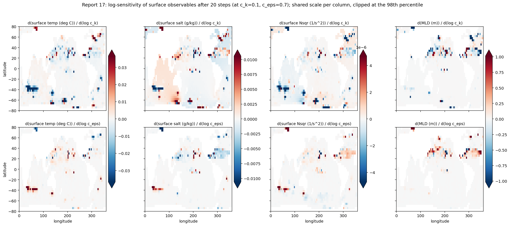
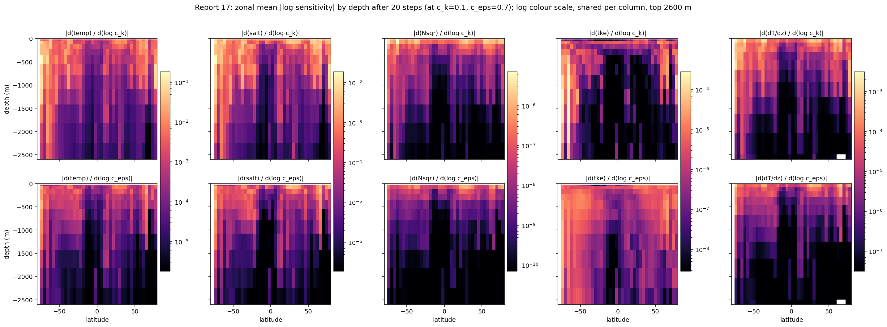
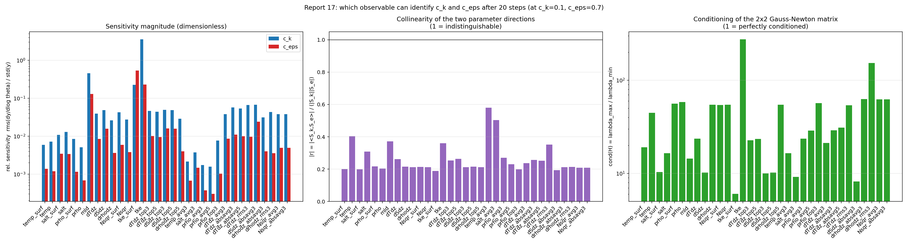
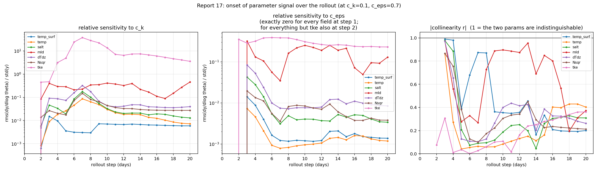
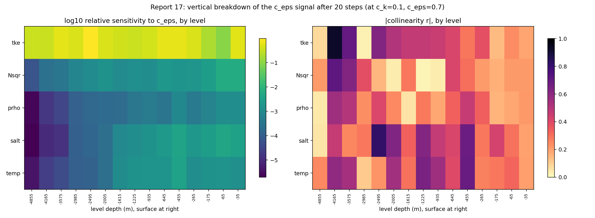
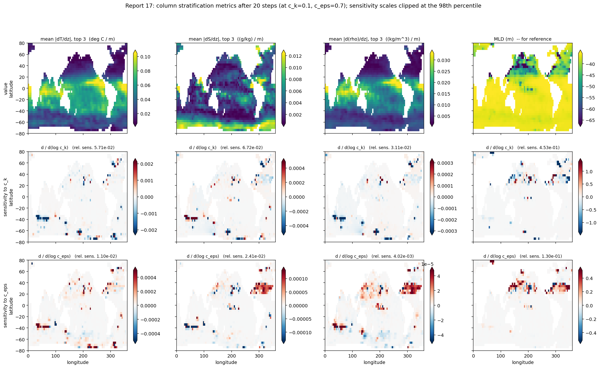
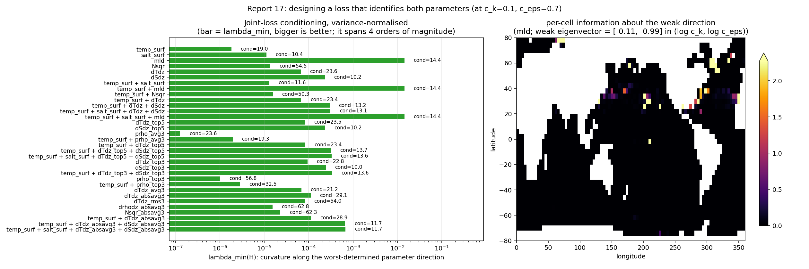
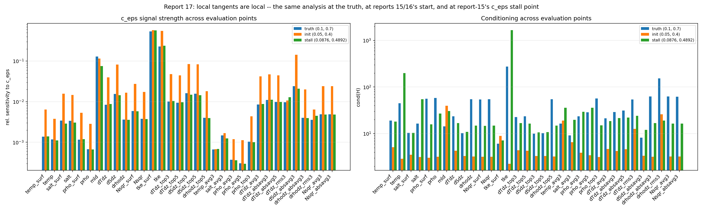
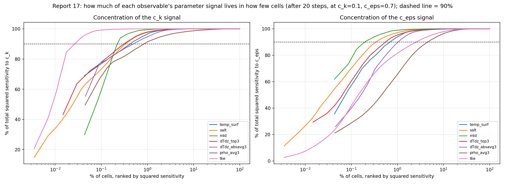

# Report 17: Forward-Mode Sensitivity and Identifiability Maps

Reports [15](report-15-surface-only-masked-loss.md) and [16](report-16-mld-loss.md) established, by running full optimizations, that a 20-day surface-temperature loss cannot identify `c_eps` while an MLD loss can. This report answers the same question directly with forward-mode AD, and tests a hypothesis about *why*.

Scripts: `Results/Report/scripts/report-17/sensitivity_maps.py` (rollouts + tangents), `figures.py` (all analysis and figures, re-runnable from the `.npy` dumps in seconds).

## Method

The rollout is chained from 20 one-step couplers, so a **single `jax.jvp` gives the parameter tangent of every field at every step**. Two parameters, many outputs, no tape: cost is one forward run per parameter.

```
S_k = c_k   * d(field)/d(c_k)     = d(field)/d(log c_k)
S_e = c_eps * d(field)/d(c_eps)   = d(field)/d(log c_eps)
```

Log-sensitivities put both parameters in fractional units. Per observable, over its valid cells:

```
H    = [[<S_k,S_k>, <S_k,S_e>],        <- Gauss-Newton Hessian of a least-squares
        [<S_k,S_e>, <S_e,S_e>]]           loss on that observable
r    = <S_k,S_e> / (|S_k| |S_e|)       <- collinearity, |r| -> 1 = flat valley
cond = lambda_max / lambda_min         <- 1 = perfectly separable
rel  = rms(S) / std(field)             <- dimensionless, comparable across units
```

`lambda_min` of the variance-normalised `H` is the curvature along the worst-determined direction: the quantity report-8's flat `c_eps` band lacks.

**Cost**: 39 s per tangent after compile; 6 tangents (3 evaluation points x 2 parameters) plus compile = ~13 min total. Report-16 needed 138 s/iter for a single scalar gradient.

**Evaluation points** (tangents are local, and report-8's low-loss band is wide): truth `(0.1, 0.7)`, reports 15/16's start `(0.05, 0.4)`, and report-15's `c_eps` stall point `(0.0876, 0.4892)`.

## Where the signal is



`c_k` acts on the Southern Ocean and the high-latitude North Atlantic/Pacific; `c_eps` acts on a different region, the 20-40N subtropical band and a South Atlantic patch. The two are spatially separated — that separation is what keeps `|r|` low at the truth.



`c_eps` is the **shallower** signal of the two. Zonal rms of `|S|` for temperature, as a fraction of its own surface value:

| depth | `c_k` | `c_eps` |
|---|---|---|
| -265 m | 0.68 | 0.44 |
| -645 m | 0.78 | 0.34 |
| -1225 m | 0.39 | 0.16 |
| -1615 m | 0.29 | 0.086 |
| -2005 m | 0.29 | 0.015 |
| -2985 m | 0.082 | 0.005 |

`c_k`'s signal is still ~30% of its surface value at 2000 m; `c_eps`'s is down to 1.5% there. A `c_eps` loss has nothing to gain below ~1000 m, which supports report-15's move to a shallow domain — but a `c_k` loss does throw away real signal by dropping the 500-2000 m range.

## Which observable identifies both parameters



Final step, at the truth:

| observable | cells | rel. sens. `c_k` | rel. sens. `c_eps` | `r` | cond | `lambda_min` |
|---|---|---|---|---|---|---|
| surface temp | 2319 | 5.89e-3 | 1.38e-3 | -0.200 | 19.0 | 1.83e-6 |
| temp, full column | 28497 | 7.21e-3 | 1.18e-3 | -0.403 | 44.8 | -- |
| surface salt | 2319 | 1.07e-2 | 3.41e-3 | -0.199 | 10.4 | 1.11e-5 |
| Nsqr | 28497 | 2.74e-2 | 3.80e-3 | -0.212 | 54.5 | 1.37e-5 |
| dT/dz | 26178 | 3.95e-2 | 8.47e-3 | -0.263 | 23.6 | 6.65e-5 |
| **dS/dz** | 26178 | 4.85e-2 | **1.56e-2** | -0.215 | **10.2** | **2.31e-4** |
| **MLD** | 2312 | 4.53e-1 | **1.30e-1** | -0.372 | 14.4 | **1.44e-2** |
| tke (surface) | 2319 | 2.25e-1 | 5.39e-1 | +0.189 | 6.06 | -- |

`tke` is the upper bound — `c_eps` is its dissipation coefficient, it is the only field where the two parameters act with the *same* sign (`r > 0`), and it is the best-conditioned field in the model. It is not observable, but it locates where the signal enters.

## Hypothesis test: is MLD's advantage "vertical structure, not values"?

**Directionally yes, but it does not explain MLD.** Vertical-gradient observables beat value observables on `c_eps`, as predicted:

| vs. surface temp | `c_eps` rel. sens. | `lambda_min` |
|---|---|---|
| Nsqr | 2.7x | 7.5x |
| dT/dz | 6.1x | 36x |
| dS/dz | 11.3x | 126x |
| MLD | 94x | 7890x |

But MLD still beats the best smooth stratification observable by **62x in `lambda_min`**. A smooth `d(rho)/dz` observable does not recover MLD's information, so "MLD reads the density gradient" is not the whole mechanism. The onset figure shows what is:



**MLD is the only observable whose `c_eps` signal grows over the rollout** (0.105 at day 5 -> 0.130 at day 20). Every instantaneous field decays ~3x over the same window (surface temp 3.98e-3 -> 1.38e-3; dT/dz 2.38e-2 -> 8.47e-3; Nsqr 1.12e-2 -> 3.80e-3). MLD's advantage is that it **integrates the mixing history**; instantaneous gradients relax back toward their forced state.

Two further onset results:

- `c_eps` has **exactly zero** effect on every field at step 1. At step 2 it appears in `tke` alone. Only from step 3 does it reach temp/salt/prho/MLD. `c_k` appears one step earlier. This is the mechanism behind report-16's "`dL/dc_eps` was exactly 0.0 at N_STEPS=2".
- `|r| ~ 0.98` for every field at step 3, falling below 0.4 by day 5-6. Short rollouts are structurally non-identifiable regardless of observable.



## Sub-observables: top layers only, and depth averages

Both are linear operations on the fields, so their tangents come straight from the same dumps — `figures.py` adds an observable and re-derives its conditioning in seconds, with no rollout. `_topN` restricts to the top N levels; `_avgN` averages over them.

`lambda_min` relative to surface temp alone, at each evaluation point:

| observable | cells | truth | init | stall | cond (truth) |
|---|---|---|---|---|---|
| surface temp | 2319 | 1x | 1x | 1x | 19.0 |
| **rho averaged over top 3** | 2248 | **0.07x** | **0.04x** | **0.22x** | 23.6 |
| rho, top 3 levels, unaveraged | 6886 | 0.6x | 1.1x | 1.3x | 56.8 |
| dT/dz, all levels | 26178 | 36x | 44x | 88x | 23.6 |
| dT/dz, top 5 | 11083 | 45x | 54x | 105x | 23.5 |
| **dT/dz, top 3** | 6775 | **52x** | **61x** | 86x | 22.8 |
| dS/dz, all levels | 26178 | 126x | 266x | 242x | 10.2 |
| **dS/dz, top 3** | 6775 | **135x** | **284x** | 236x | 10.0 |
| temp_surf + dT/dz + dS/dz, all levels | 54675 | 164x | 313x | 334x | 13.2 |
| **temp_surf + dT/dz + dS/dz, top 3** | 15869 | **188x** | **348x** | 323x | 13.6 |

**Restricting the gradients to the top layers is a strict win.** `dT/dz` on the top 3 levels beats the full column by 1.4x in `lambda_min` while using 26% of the cells, with slightly *better* conditioning (22.8 vs 23.6). The deep cells were adding cost and noise, not information — consistent with the depth profile above. The effect is much weaker for `dS/dz` (1.07x), whose signal is already concentrated near the surface. Top-3 beats top-5 for `dT/dz`; both beat the full column.

**Depth-averaging the density is the worst observable tested.** `rho` averaged over the top 3 levels has `lambda_min` **14x below surface temperature**, and 8x below the same three levels left unaveraged. The reason is mechanical: TKE mixing *redistributes* heat and salt within the mixed layer, nearly conserving the column integral, so averaging over exactly that layer cancels the signal it is meant to measure. Averaging also makes the two parameters more collinear (`|r|` for `temp_avg3` is 0.58 vs 0.20 for surface temp; the same for `salt_avg3` at 0.50).

This sharpens the report's main theme. Vertical *differencing* keeps the structure mixing creates; vertical *averaging* destroys it. `prho_avg5` is worse still than `prho_avg3`, as that reading predicts.

## A 2D stratification metric

`mean(|dT/dz|)` over the top 3 interfaces collapses the column to **one number per cell**, so it maps like MLD but is smooth everywhere — no discrete level selection. It is nonlinear, but its tangent is still exact from the same dumps by the chain rule (`d/dtheta mean|g| = mean(sign(g) * dg/dtheta)`).



The `c_eps` sensitivity of the temperature and salinity metrics is a **coherent broad patch** across the 20-40N band, not the scattered isolated cells that dominate the value fields. Compare the reference MLD panel: MLD's own value field is nearly saturated at ~-50 m with only a handful of distinct columns.

| observable | cells | `lambda_min` vs surface temp (truth / init / stall) | `r` | cond |
|---|---|---|---|---|
| surface temp | 2319 | 1x / 1x / 1x | -0.200 | 19.0 |
| `mean(dT/dz)` top 3, signed | 2208 | 38x / 44x / 46x | -0.236 | 21.2 |
| **`mean(\|dT/dz\|)` top 3** | 2208 | **62x / 65x / 66x** | -0.256 | 29.1 |
| `rms(dT/dz)` top 3 | 2208 | 45x / **5.6x** / 82x | -0.351 | 54.0 |
| `mean(\|d(rho)/dz\|)` top 3 | 2208 | 8x / 22x / 18x | -0.212 | 62.8 |
| `mean(\|Nsqr\|)` top 3 | 2248 | 13x / 32x / 26x | -0.209 | 62.3 |
| dT/dz + dS/dz per-cell, top 3 (+ surf temp) | 15869 | 188x / 348x / 323x | -0.223 | 13.6 |
| **`mean(\|dT/dz\|)` + `mean(\|dS/dz\|)` top 3 (+ surf temp)** | **6735** | **366x / 845x / 477x** | **-0.194** | **11.7** |

**This is the best smooth loss found.** Collapsing the three interfaces into one number per column is ~2x better than keeping them as separate residuals, on 42% of the cells, with better conditioning. Treating three strongly correlated interfaces as independent measurements dilutes each; aggregating them coherently does not. `mean(|dS/dz|)` has the lowest collinearity of any observable tested (`|r| = 0.194`).

Three qualifications:

- **The absolute value matters**: the signed mean is 62x -> 38x worse, because it partly telescopes to a surface-minus-depth difference and cancels sign-reversed columns (high-latitude inversions).
- **Use the mean, not the rms**: `rms(dT/dz)` looks competitive at the truth (45x) but collapses to 5.6x at the start point. The mean-absolute reduction is stable across all three points (62x / 65x / 66x); the rms is not.
- **Density stratification is the wrong metric.** `mean(|d(rho)/dz|)` and `mean(|Nsqr|)` are 5-8x weaker than the temperature version and badly conditioned (cond ~63). Combining T and S into density partially cancels the parameter signal — the same reason `prho` and `Nsqr` sit at the bottom of the main table. Keep temperature and salinity gradients as separate loss terms.

MLD still leads by ~22x (7890x vs 366x), so this does not replace it — but it is smooth, mappable, and 22x closer than anything else available.

## Designing the loss



`lambda_min` relative to surface temp alone, at the three evaluation points:

| loss | truth | init | stall |
|---|---|---|---|
| surface temp | 1x | 1x | 1x |
| + surface salt | 7.1x | 11x | 10x |
| + dT/dz | 37x | 45x | 90x |
| **+ dT/dz + dS/dz** | **164x** | **313x** | **334x** |
| + MLD | 7890x | 993x | 9842x |

`temp_surf + dT/dz + dS/dz` also *improves* conditioning rather than trading it away: `cond` 19.0 -> 13.2 at the truth, and at report-15's stall point `|r|` drops 0.824 -> 0.586 with `cond` 18.1 -> 12.4. Salinity earns its place — `dS/dz` is the single best smooth observable on both `lambda_min` and `cond`.



The geometry is strongly local. At report-15's stall point, surface temperature's two parameter directions are **82% collinear** (`|r| = 0.824`, vs 0.200 at the truth) — that is the flat valley report-15 stalled in, and it is a property of that region, not of the truth. Note also that at the start point `c_eps`'s signal in surface temp (6.4e-3) is *larger* than `c_k`'s (5.6e-3): the run does not fail from a weak `c_eps` signal, it fails by drifting into a collinear region. MLD is the only observable whose `c_eps` signal is stable across all three points (0.13, 0.12, 0.075).

## Caveat: the signal is extremely concentrated



Percentage of cells carrying 90% of the squared sensitivity:

| observable | `c_k` | `c_eps` |
|---|---|---|
| surface temp | 0.43% | 0.69% |
| salt | 0.34% | 0.34% |
| MLD | 0.26% | 0.22% |
| dT/dz | 0.10% | 0.16% |
| dS/dz | 0.16% | 0.16% |

Report-16 attributed MLD's roughness to its loss being dominated by a few dozen columns. That concentration is **not specific to MLD** — every observable here puts 90% of its gradient in under 0.7% of cells, and MLD is not the worst. The MLD-specific problem is the discreteness of the level-flip jumps, not the concentration.

## Takeaway

1. **Best available loss**: `surface temp + mean(|dT/dz|) + mean(|dS/dz|)`, both gradient means taken over the top 3 interfaces, variance-normalised. 366x / 845x / 477x the curvature of surface temp alone in the weak direction at the three evaluation points, the best conditioning of any combination tested (11.7 vs 19.0), smooth everywhere, and evaluated on 6735 cells — three 2D fields. Salinity gradients carry more `c_eps` information than temperature gradients; keep them as separate terms rather than combining into density.
2. **MLD remains 22x better still**, and its advantage is time-integration, not stratification. The way to get it smoothly is a **time-integrated** stratification observable — which points back at the `mld_ma` moving average from Veros-Autodiff's report-mld-2 that report-16 deliberately dropped.
3. **Do not depth-average.** Averaging density or temperature over the mixed layer cancels the redistribution signal: `rho` averaged over the top 3 levels is 14x *worse* than surface temperature alone. Difference vertically, do not average vertically.
4. **Do not fit below ~5 steps.** `c_eps` reaches non-TKE fields only at step 3, and `|r| ~ 0.98` until day 5.
5. **Local geometry matters.** Diagnose at the start point, not just at the truth: report-15's failure is a collinear region the trajectory wanders into, not a globally weak signal.

Next: run the fit with the loss from (1) and compare against reports 15/16. `figures.py` re-derives conditioning for any new observable combination from the existing dumps in seconds, so candidate losses can be screened before any optimization is run.
