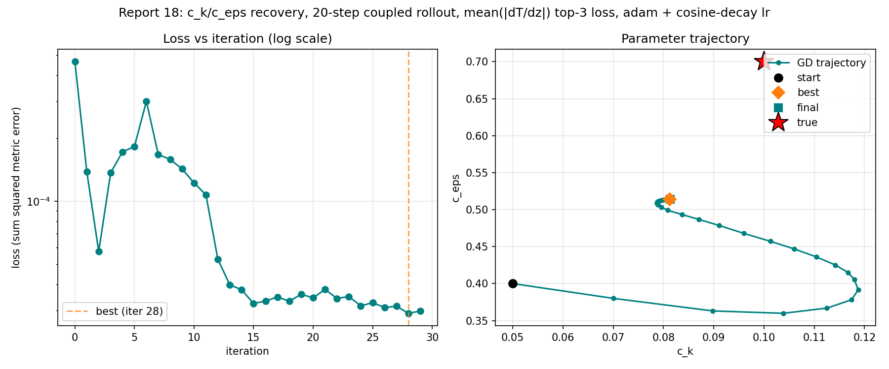
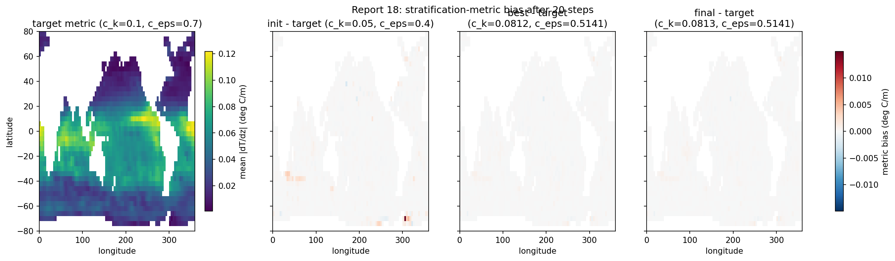
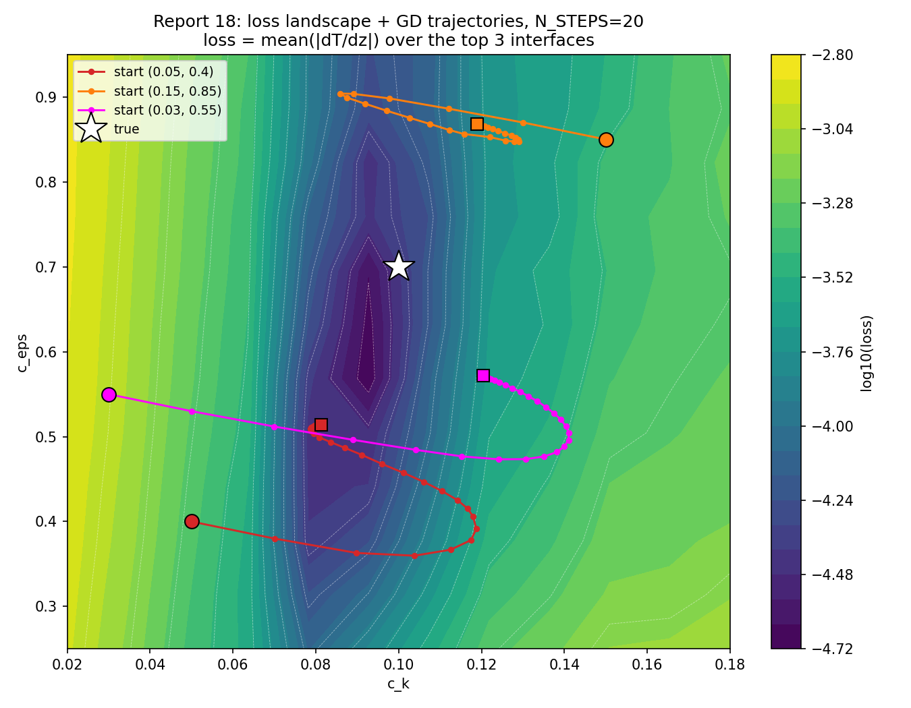
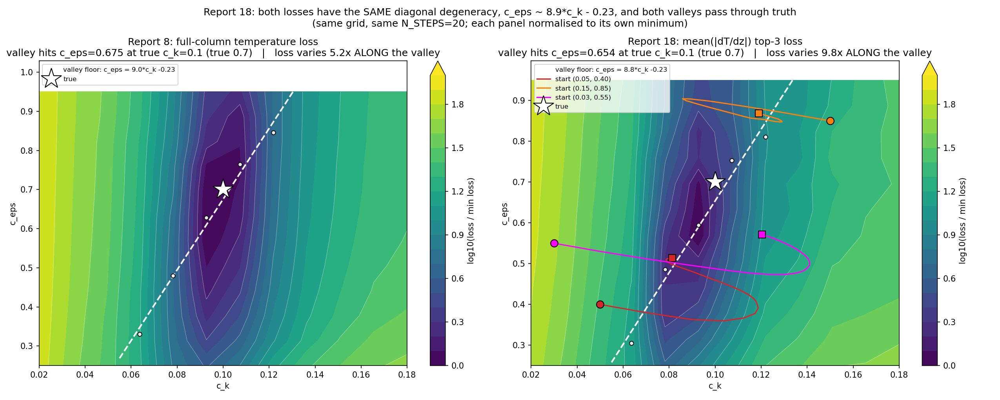
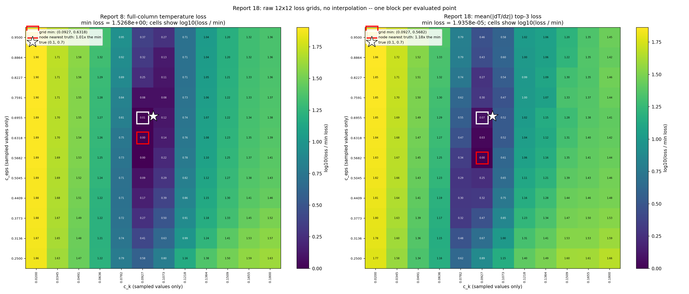
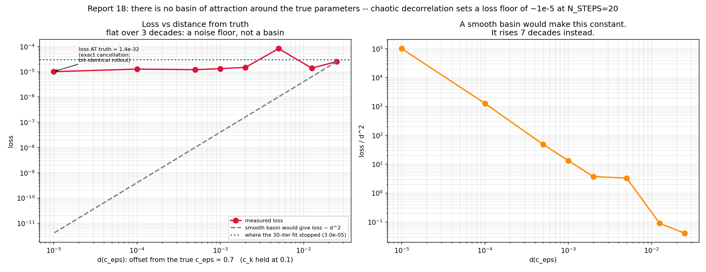

# Report 18: Stratification Loss

Same recipe as [report-15](report-15-surface-only-masked-loss.md) (`optax.adam` + cosine-decay lr, N_ITERS=30, N_STEPS=20, start `c_k=0.05, c_eps=0.4`) with one change: the observable is the [report-17](report-17-forward-sensitivity-identifiability.md) stratification metric,

```
strat(x, y) = mean over the top 3 interfaces of |dT/dz|
```

one number per column, 2208 of 3600 surface cells, smooth everywhere (no discrete level selection, unlike MLD).

Report-17 predicted from forward-mode tangents alone that this observable carries **62x** surface temperature's curvature along the worst-determined parameter direction. This report tests that prediction against an actual fit, plus a 12x12 landscape scan and a 3-start multistart on report-8's exact grid.

Scripts: `Results/Report/scripts/report-18/{common,fit_and_generate_figures,landscape_multistart,landscape_comparison}.py`. Run on Grid5000 grenoble (OAR job 3094973, ~276 s/iter, CPU).

## Result: the prediction did not hold

| | c_k (true 0.1) | c_eps (true 0.7) | loss range |
|---|---|---|---|
| report-15, surface temp | 0.0876 (12% low) | 0.4892 (30% low) | 3.2x |
| report-16, MLD | 0.1346 (35% high) | 0.6332 (10% low) | 20.8x |
| **report-18, mean(\|dT/dz\|)** | **0.0813 (19% low)** | **0.5141 (27% low)** | **16.0x** |



`c_eps` ends at 0.514 against report-15's 0.489 — a 30% error becomes a 27% error. That is **not** the improvement a 62x curvature gain predicts, and `c_k` is slightly worse (19% vs 12%). The one clear gain is loss dynamic range: 16.0x vs 3.2x, so the loss is far more informative per iteration even though the recovered parameters barely moved.



Metric RMSE falls 4.0x (0.98% -> 0.25% of the mean metric) between init and best, so the fit *is* fitting the observable well. It is the parameters that don't follow.

## Multistart: same signature as report-15

| start (c_k, c_eps) | end (c_k, c_eps) | c_eps drift from its own start |
|---|---|---|
| (0.05, 0.40) | (0.0813, 0.5141) | +0.114 (29%) |
| (0.15, 0.85) | (0.1190, 0.8680) | +0.018 (2%) |
| (0.03, 0.55) | (0.1204, 0.5718) | +0.022 (4%) |

The three runs end at `c_eps` = 0.51, 0.87, 0.57 — close to their own starts (0.40, 0.85, 0.55), nowhere near each other and nowhere near 0.7. This is the same signature report-15 reported: a flat, uninformative direction rather than distinct local minima. `c_k` behaves better, landing in 0.081-0.120 from every start.

## Why: the landscape



The scan explains the fit exactly — but only once the degeneracy is measured along the right direction. Locating each column's minimum to sub-grid accuracy (parabolic interpolation) and fitting a line to it:

| landscape | valley floor | `c_eps` at true `c_k`=0.1 | loss variation ALONG the valley |
|---|---|---|---|
| report-8, full-column temperature | `c_eps = 9.03*c_k - 0.228` | 0.675 (true 0.7, 0.4 grid cells low) | 5.2x |
| report-18, mean(\|dT/dz\|) | `c_eps = 8.79*c_k - 0.225` | 0.654 (true 0.7, 0.7 grid cells low) | 9.8x |



**Both losses have the same diagonal degeneracy**, `c_eps ~ 8.9*c_k - 0.23`, to within the grid resolution — nearly identical slopes (9.03 vs 8.79) and intercepts. Neither parameter is individually identifiable; what both losses constrain is the *combination* `c_eps - 8.9*c_k`. Both valleys pass through the true parameters, as they must for a synthetic target, which is also why the grid minimum sits at a node adjacent to the star rather than on it: the floor is nearly level near truth and the grid is coarse (`dc_eps` = 0.064).

### The grid never samples the truth

`contourf` interpolates between the 12 sampled values per axis, which moves the apparent dark region off the evaluated nodes. Drawn as raw cells instead — one block per evaluated point, every value printed:



This makes the honest limitation visible: **the scan evaluates `c_k` at 0.0927 and 0.1073 and `c_eps` at 0.6318 and 0.6955, and never at the true (0.1, 0.7)**. Truth falls between sampled columns, so the star cannot coincide with the darkest sampled cell no matter what the loss does. The coarse grid therefore *cannot* confirm that the minimum sits at truth; it only shows that the node nearest truth is 1.01x (report-8) and 1.18x (report-18) of the grid minimum. `refine_near_truth.py` settles it directly by evaluating the loss on the truth, where it is exactly zero by construction, and on a fine grid around it (`dc_k` = 0.005, `dc_eps` = 0.025).

This is what the fit does. The endpoint `(0.0813, 0.5141)` lies **on** the valley: `8.79 * 0.0813 - 0.225 = 0.489`, against the 0.514 reached. The optimizer finds the valley in ~12 iterations and then slides along it until the cosine-decayed lr expires. Where it stops is set by the schedule, not by the data — which is exactly report-15's failure, unchanged.

The one real gain is that the stratification loss varies **9.8x along the valley** against temperature's 5.2x, so it breaks the degeneracy about twice as well. That is the honest size of the improvement, and it matches the fit: 30% -> 27% error in `c_eps`, not the 62x that a local curvature ratio suggested.

## There is no basin around the truth

The coarse grid never samples `(0.1, 0.7)`, so `refine_near_truth.py` evaluates it directly, and `basin_width.py` walks `c_eps` toward it on a log ladder at fixed `c_k = 0.1`.

**Loss at the true parameters = 1.4e-32** — floating-point zero, 27 orders below the coarse grid's minimum of 1.94e-5. The minimum is exactly where it must be. But that value is *exact cancellation*: at the true parameters the rollout is bit-identical to the target, so the residual is identically zero. It is an identical-twin artifact, not a minimum an optimizer can find. The approach to it is what matters:

| offset `d` from true `c_eps` | 2.5e-2 | 1.3e-2 | 5e-3 | 2e-3 | 1e-3 | 5e-4 | 1e-4 | 1e-5 | 0 |
|---|---|---|---|---|---|---|---|---|---|
| loss | 2.54e-5 | 1.39e-5 | 8.28e-5 | 1.49e-5 | 1.33e-5 | 1.21e-5 | 1.28e-5 | 1.01e-5 | **1.4e-32** |



**The loss does not decrease as the parameters approach truth.** A perturbation of `d = 1e-5` (0.0014% of `c_eps`) gives 1.01e-5, statistically the same as `d = 2.5e-2`, 2500 times larger. `loss/d^2`, which a smooth quadratic basin would hold constant, instead rises seven decades. The sequence is not even monotone (8.28e-5 at `d = 5e-3` sits above both neighbours).

The 37-point fine grid around truth says the same in 2-D: over `c_k` +/- 0.015 and `c_eps` +/- 0.10 the loss varies only **4.0x**, with no organised descent.

So the loss surface is a **rough floor at ~1e-5 with a zero-width needle at the exact solution**. There is no basin of attraction at any scale a gradient method can use.

This is [report-3](report-3-ck-ceps-coupled-fit-n20-and-chaos-bracket.md)'s chaos result seen from the loss side. That report found finite-difference gradients at N_STEPS=20-25 failing to converge or even hold a sign, because "perturbing `c_k` by as little as 1e-4 sends the coupled trajectory onto a different, chaotically diverged realization by the end of the rollout". A parameter perturbation too small to matter physically still decorrelates the 20-day trajectory, and the resulting field difference is what the floor measures.

### Consequence: more iterations cannot help

The 30-iteration run finished at loss 2.98e-5, already inside the 1.0e-5 to 4.0e-5 floor. It had converged as far as this loss can distinguish, and the remaining 27% error in `c_eps` is not an optimization shortfall — it is the parameter uncertainty the floor permits. Extending the schedule gives the optimizer nothing to descend.

This also reframes reports 8, 15 and 16: the ~10-30% parameter errors they each stall at, from different observables and different optimizers, are plausibly all the same quantity — the intrinsic precision of a 20-day identical-twin fit under chaotic decorrelation — rather than four separate optimization or identifiability problems.

## Why report-17's prediction overshot

Not because its magnitudes were wrong, but because it had the **direction of the degeneracy wrong**. Report-17's weak eigenvector, computed at the truth for the exact observable this report's loss uses (`mean(|dT/dz|)` over the top 3 interfaces):

| | weak direction in (log `c_k`, log `c_eps`) | angle |
|---|---|---|
| report-17, local Gauss-Newton at truth | [+0.051, +0.999] | 87.1 deg |
| report-18, global valley from the grid scan | [+0.623, +0.782] | 51.5 deg |
| | | **mismatch 35.6 deg** |

The local analysis says the weak direction is almost purely `c_eps` (87 deg — "`c_eps` is the badly determined *parameter*"). The grid scan says it is a 51 deg diagonal — a badly determined *combination* of both. Report-17 was therefore measuring curvature across the wrong axis, which is why its `lambda_min` ratios did not predict the fits. Both landscapes agree with each other on the global direction (51.5 vs 52.2 deg), so the degeneracy is a property of the 20-day coupled rollout, not of the observable.

A local Gauss-Newton matrix is exact only infinitesimally. Over the finite region an optimizer actually traverses, this valley is curved enough that the local weak direction at truth is off by 36 deg — enough to invert the conclusion.

## Takeaway

1. **The 20-day identical-twin loss has a floor at ~1e-5 and no basin around the truth.** A `c_eps` perturbation of 1e-5 gives the same loss as one of 2.5e-2. This is chaotic decorrelation ([report-3](report-3-ck-ceps-coupled-fit-n20-and-chaos-bracket.md)) seen from the loss side, and it caps what *any* gradient method can recover at N_STEPS=20, independent of observable, optimizer or schedule.
2. **More iterations cannot help.** The 30-iteration run already finished inside the floor (2.98e-5). Its 27% `c_eps` error is the precision the floor permits, not an optimization shortfall.
3. **The ~10-30% errors across reports 8, 15, 16 and 18 are plausibly one quantity, not four problems.** Before attributing any of them to identifiability or to the optimizer, the floor should be measured for that loss — 8 forward evaluations, as here.
4. **Above the floor, the degeneracy is diagonal.** Both losses constrain `c_eps - 8.9*c_k` and leave the orthogonal direction loose, to within grid resolution. Reporting "`c_eps` is unidentifiable" (reports 8, 15, 17, and the first draft of this one) is an artifact of looking along the parameter axes.
5. **Changing the observable did not change the degeneracy.** The stratification loss breaks it about 2x better than temperature (9.8x vs 5.2x variation along the valley floor) — real but modest, and consistent with 30% -> 27%.
6. **Combining temperature with gradient terms should not be expected to fix `c_eps`.** Their valleys are nearly parallel, and a second term only helps if its valley crosses this one at a large angle. In any case the floor binds first.
7. **What would actually move the needle**: shortening the rollout below the chaos onset (report-3 brackets it), averaging over an ensemble or a time window to suppress the decorrelation noise, or an observable that integrates over the rollout rather than reading the final state (MLD, the only one that has moved `c_eps`, is of that kind). Report-17's local-tangent screening cannot see any of this and should not be used alone.

## Note on run integrity

The trajectories in this report were produced by a single uninterrupted job. An earlier attempt was discarded: three duplicate OAR jobs raced on the same checkpoint files and produced visibly different trajectories from the same start (`c_eps` 0.905 vs 0.915). The root cause was more general than the race — `optimizer.init` rebuilds adam's moment estimates from zero, so *any* resumed run is a different recipe from an uninterrupted one and is not comparable to report-15/16. `common.py` now reuses only **complete** trajectories, discards partial ones and restarts them, and takes a lock on the output directory so concurrent jobs fail loudly. The grid scan is immune (each point is an independent forward eval) and was kept from the earlier attempt.
