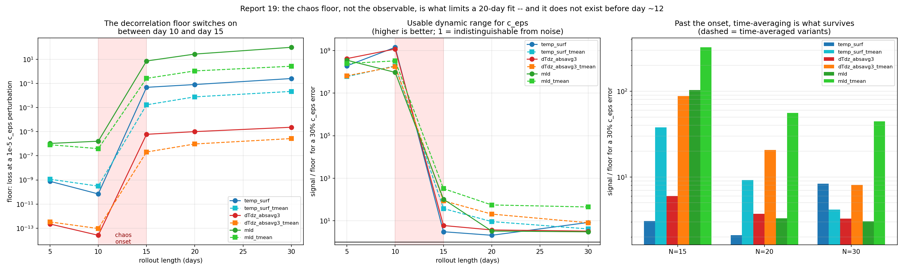

# Report 19: Signal-to-Floor vs Rollout Length

[Report-18](report-18-stratification-loss.md) found that a 20-day identical-twin loss sits on a floor set by chaotic decorrelation: perturbing `c_eps` by 1e-5 gives the same loss as perturbing it by 2.5e-2. The whole optimization had only 46x of usable dynamic range and stalled 3x above the floor, so the recovered parameters were limited by the floor, not by the observable or the optimizer.

That makes one quantity decisive for any future fit:

```
signal / floor  =  loss(c_eps wrong by 30%, i.e. 0.49 vs 0.70)
                   ----------------------------------------------
                   loss(c_eps wrong by 1e-5)
```

This measures it for every candidate observable at every rollout length, at the cost of **4 rollouts** rather than a multi-hour fit. A single chained rollout to 30 steps yields every checkpoint and every time-average at once, so the whole study is ~15 minutes.

Script: `Results/Report/scripts/report-19/{signal_to_floor,figures}.py`.

## Result



| N | temp_surf floor | dTdz floor | mld floor | best S/F (30% `c_eps` error) |
|---|---|---|---|---|
| 5 | 7.7e-10 | 2.2e-13 | 1.1e-6 | 4.2e8 |
| **10** | **7.0e-11** | **2.6e-14** | **1.6e-6** | **1.4e9** |
| 15 | 4.7e-2 | 6.1e-6 | 7.2e0 | 3.2e2 |
| 20 | 8.1e-2 | 1.0e-5 | 2.7e1 | 5.6e1 |
| 30 | 2.5e-1 | 2.3e-5 | 9.8e1 | 4.5e1 |

**The floor switches on between day 10 and day 15, and jumps nine orders of magnitude when it does.** Before the onset there is effectively no floor: a 30% `c_eps` error is ~1e9 times louder than a 1e-5 perturbation. After it, that ratio is 2-56 depending on observable.

This is the dominant effect in the whole series. At N=20 the best observable beats the worst by 27x; moving from N=20 to N=10 buys 1e7. **Rollout length matters ten million times more than the choice of observable.**

It also brackets [report-3](report-3-ck-ceps-coupled-fit-n20-and-chaos-bracket.md)'s chaos onset more tightly and from the loss side rather than from finite-difference gradient failure: the transition is inside [10, 15], not [20, 25].

## Time-averaging suppresses the floor

Past the onset, the time-averaged variant of every observable beats its instantaneous counterpart, as expected if the floor is decorrelation *variance* (averaging over T samples suppresses it ~1/sqrt(T) while the parameter signal survives):

| observable, N=20 | instantaneous | time-averaged | gain |
|---|---|---|---|
| MLD | 3.3 | **55.7** | **17x** |
| mean(\|dT/dz\|) top 3 | 3.7 | 20.7 | 5.6x |
| surface temp | 2.1 | 9.2 | 4.4x |

The best long-rollout option by a wide margin is **time-averaged MLD**. That is the `mld_ma` moving average from Veros-Autodiff's report-mld-2 which [report-16](report-16-mld-loss.md) deliberately dropped in favour of the instantaneous last-state MLD; dropping it cost a factor of 17.

## What this says about the earlier reports

- **MLD is not intrinsically a better observable.** At N=20 instantaneous MLD (S/F = 3.3) is barely above surface temperature (2.1). Report-16's better `c_eps` recovery came from MLD's larger *signal*, not from a lower floor.
- **Report-15's failure was not about surface temperature.** At N=20 no instantaneous observable has usable range. The observable was blamed for what the rollout length caused.
- **Report-17's local tangent screening cannot see any of this.** It measures curvature at a point in a noise-free sense and has no notion of a decorrelation floor, which is why its 62x prediction did not survive contact with a fit ([report-18](report-18-stratification-loss.md)).

## Takeaway

1. **Fit at N_STEPS=10, not 20.** Worth ~7 orders of magnitude in usable dynamic range and makes the observable choice nearly irrelevant. The lower bound is identifiability, not noise: report-17 found `c_eps` reaches temperature only at step 3 and `|r|` ~ 0.98 until day 5-6, so ~10 is the sweet spot between the two constraints.
2. **If a 20-day rollout is required, use time-averaged MLD**, and time-average whatever observable is chosen.
3. **Measure the floor before blaming an observable or an optimizer.** It is 4 rollouts. Reports 8, 15, 16 and 18 each attributed a floor-limited result to something else.

Next: `report-20` runs report-15's exact recipe -- the surface-temperature loss that stalled at `c_eps` = 0.489 -- at N_STEPS=10, to test whether the simplest observable recovers `c_eps` once no floor is binding. A finer bracket of the onset over N in [11, 14] is the other obvious follow-up.
