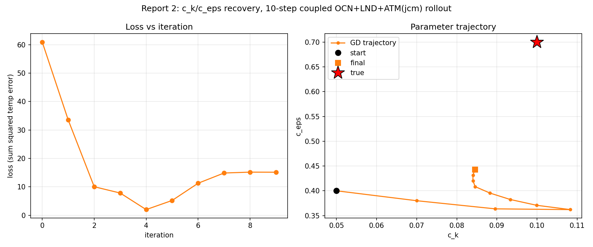
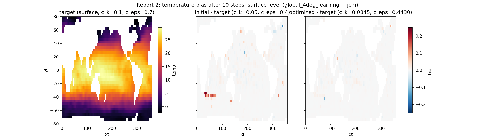

# c_k/c_eps Parameter Recovery, Longer Coupled Rollout (10 steps)

Same fit as Report 1 -- Veros' TKE parameters `c_k`, `c_eps` recovered by
gradient descent through the coupled OCN(`global_4deg_learning`) +
JCM land/atmosphere model -- but doubling the rollout length (`N_STEPS=10`
vs. 5) to see how the fit behaves with more integration time for `c_eps`'s
slower dynamics to register, following the same before/after comparison
pattern as Veros-Autodiff's `report-2/section3b_ck_ceps_long_rollout.py`
(which swept rollout length for the pure-Veros case).

Script: `Results/Report/scripts/report-2/fit_and_generate_figures.py`
(runs the fit itself, unlike Report 1's figure script which replayed an
already-completed fit).

## Method

Identical setup to Report 1 (same true params `c_k=0.1, c_eps=0.7`, same
wrong starting guess `c_k=0.05, c_eps=0.4`, same `optax.adam(lr=2e-2)`),
except `N_STEPS=10` and `N_ITERS=10` (fewer iterations than Report 1's 15,
since each one costs roughly 2x as long here).

## Results

| iter | loss | c_k | c_eps |
|---|---|---|---|
| init | -- | 0.0500 | 0.4000 |
| 0 | 6.088e+01 | 0.0700 | 0.3800 |
| 1 | 3.349e+01 | 0.0896 | 0.3636 |
| 2 | 1.005e+01 | 0.1083 | 0.3621 |
| 3 | 7.837e+00 | 0.0999 | 0.3708 |
| 4 | 2.014e+00 | 0.0933 | 0.3825 |
| 5 | 5.220e+00 | 0.0883 | 0.3953 |
| 6 | 1.127e+01 | 0.0846 | 0.4084 |
| 7 | 1.487e+01 | 0.0840 | 0.4202 |
| 8 | 1.518e+01 | 0.0840 | 0.4317 |
| 9 | 1.515e+01 | 0.0845 | 0.4430 |

`c_k` **overshoots the true value early** (0.1083 at iteration 2, then
0.0999 at iteration 3 -- both within 1-8% of true 0.1) before drifting back
down to 0.0845 as the optimizer keeps chasing `c_eps` (still far from its
0.7 true value at iteration 9). `c_eps` moves further than in Report 1 at
the same iteration count on an absolute basis, but not much (0.38 -> 0.44
here vs. 0.38 -> 0.42 in Report 1 at iteration 7) -- consistent with it
being the slower parameter regardless of rollout length, though a longer
window should in principle grow its gradient signal relative to `c_k`'s.

The loss curve shows the same overshoot-then-recover shape as Report 1, but
sharper: a clear minimum at iteration 4 (2.01, well below Report 1's
best of 4.11) followed by a rise to a ~15 plateau by iteration 7-9, rather
than Report 1's slower recovery back down. The parameter-space plot shows
`c_k` passing directly through a region very close to the true point around
iteration 2-3 before being pulled back by the still-large `c_eps` gradient.

As in Report 1, the bias fields are visually sparse/small-magnitude at this
colorbar scale -- 10 days still isn't long enough for TKE mixing
differences to leave a large, spatially broad surface temperature
signature. The optimized-vs-target bias is not obviously smaller than the
initial-vs-target bias here (unlike Report 1), consistent with the fit
having drifted away from its iteration-4 minimum by the final iteration.

## Interpretation: what changed vs. Report 1

- **Same qualitative pattern (overshoot, recover) but compressed into fewer
  iterations** -- Report 1 (5 steps) troughs at iteration 3 and mostly
  recovers by iteration 14; Report 2 (10 steps) troughs sharper at
  iteration 4 and has *not* recovered by iteration 9 (its last). This is
  consistent with the loss landscape simply having a bigger `c_k` gradient
  relative to `c_eps` at longer rollout lengths too, not just short ones --
  the fixed-`lr` Adam step is still overshooting `c_k`'s optimum.
- **Confirms this isn't a length-5-specific artifact.** The core
  differentiability result (gradients through the coupled model are usable
  for real optimization, not just isolated checks) reproduces at 2x the
  rollout length with no new instability, NaN, or divergence -- the
  overshoot behavior is an optimizer-hyperparameter issue, not a model or
  gradient-correctness issue.
- **`c_eps` still needs more iterations than either run gave it.** Both
  reports stop well short of `c_eps` converging. A natural follow-up (not
  done here, to keep this run's cost bounded) is more iterations at a fixed
  rollout length, or per-parameter learning rates so `c_k` doesn't overshoot
  while waiting for `c_eps`.

## Caveats

Same as Report 1: no finite-difference cross-check in this report (done
separately, see `run_jcm_global4deg_grad.py`), no 2D loss-landscape grid
scan (cost-prohibitive at this rollout length -- each grid point is a full
~10-step coupled rollout), single run/seed. Per-iteration wall time here
(~1-4 min, worse under concurrent system load) roughly doubled relative to
Report 1's 5-step runs, consistent with the expected linear-in-steps cost
of the coupler's checkpointed `lax.scan` (see the earlier debug-script
investigation and the Veros-Autodiff long-rollout report's compile/memory
findings, `Veros-Autodiff/Results/Report/report-longrollouts-1.md`) --
worth keeping in mind before pushing `N_STEPS` much further without
budgeting proportionally more wall time.
