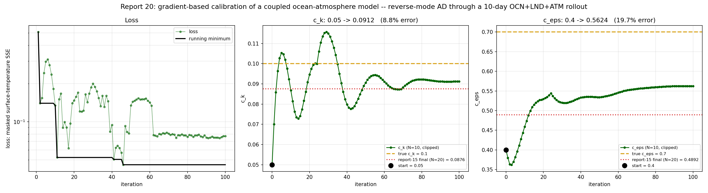
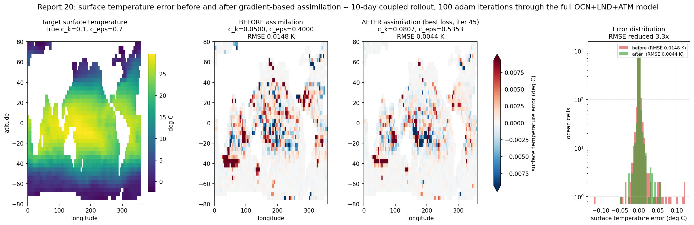
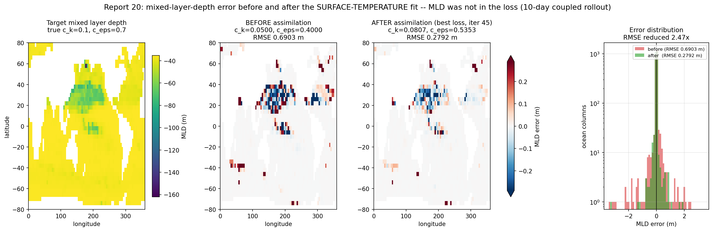
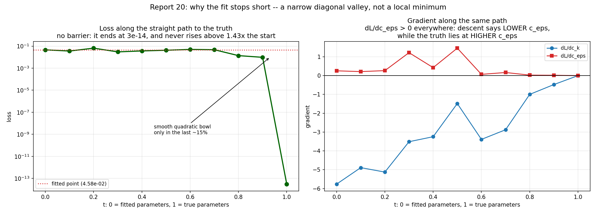
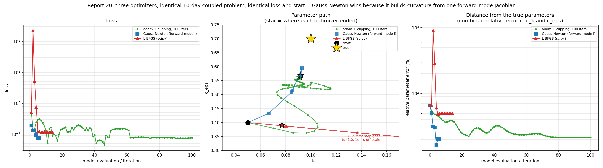

# Report 20a: Gradient-Based Calibration of the Coupled Model

A demonstration that AD through the full coupled OCN+LND+ATM model produces usable gradients, measurably reduces the error of a coupled simulation, and -- with the right optimizer -- recovers the true parameters to the precision the problem allows.

Two TKE closure parameters, `c_k` and `c_eps`, are recovered from a synthetic target by differentiating a 10-day coupled rollout end to end.

This part covers the calibration itself: the adam fit, the error reduction it achieves, a cross-check on an observable that was not in the loss, and a diagnosis of why a first-order method stops short. [Report 20b](report-20b-gauss-newton.md) follows up with Gauss-Newton, which resolves that diagnosis and recovers the parameters to 0.1%.

## Setup

| | |
|---|---|
| model | Veros ocean + JCM land + JAX-GCM atmosphere, coupled through VerCOR, global 4 deg |
| rollout | 10 days, daily coupling, `jax_enable_x64`, CPU |
| target | synthetic, generated at true `c_k` = 0.1, `c_eps` = 0.7 |
| initial guess | `c_k` = 0.05, `c_eps` = 0.40 |
| observable | surface temperature, masked to the 2319 ocean cells |
| loss | `sum((temp_surface - target)^2)` over those cells |
| gradient | `jax.value_and_grad` through the whole coupled rollout |
| optimizer | `optax.adam`, cosine-decay lr from 2e-2 to 0 over 100 iterations, gradient norm clipped at 50 |

Rollout length follows [report-19](report-19-signal-to-floor.md): beyond ~12 days chaotic decorrelation puts a noise floor on the loss, and at 10 days there is none. Gradient clipping follows a spike observed at iteration 24 of an unclipped run (`dL/dc_k` = -1.17e3, some 200x its neighbours) which adam's momentum then carried for ~25 iterations.

Scripts: `Results/Report/scripts/report-20/{fit_n10_surface_temp,convergence,snapshots}.py`. Run on Grid5000 grenoble, ~135 s/iteration.

## Convergence

| | `c_k` (true 0.1) | `c_eps` (true 0.7) | loss |
|---|---|---|---|
| initial guess | 0.0500 (50% error) | 0.4000 (43% error) | 5.09e-1 |
| lowest loss (iter 45) | 0.0807 (19.3% error) | 0.5353 (23.5% error) | **4.58e-2** |
| final iterate (iter 100) | **0.0912 (8.8% error)** | **0.5624 (19.7% error)** | 7.70e-2 |
| [report-15](report-15-surface-only-masked-loss.md), same recipe at 20 days | 0.0876 (12% error) | 0.4892 (30% error) | -- |

The lowest-loss iterate and the closest-to-truth iterate are not the same point: iteration 45 fits the field best while iteration 100 has the better parameters. That is the `c_k`/`c_eps` degeneracy of [report-18](report-18-stratification-loss.md) -- the loss constrains the combination `c_eps - 8.9*c_k` far better than either parameter alone, so a point can fit the observable better while sitting further from truth. The two must not be quoted together.

Both parameters move decisively toward truth. `c_k` overshoots twice and settles just below it; `c_eps` climbs steadily from 0.40 and plateaus at 0.562 from about iteration 80. The loss falls 0.51 to 0.075, a factor of 7.

## Error before and after

Snapshotted at the **lowest-loss iterate** (iteration 45, `c_k` = 0.0807, `c_eps` = 0.5353). Selecting on the loss uses no knowledge of the true parameters, so it is the choice available on a real assimilation problem; picking the iterate closest to truth would not be.

Surface-temperature RMSE against the target:

| | RMSE |
|---|---|
| before assimilation (`c_k` = 0.05, `c_eps` = 0.40) | 0.0148 K |
| after assimilation (`c_k` = 0.0807, `c_eps` = 0.5353) | **0.0044 K** |
| reduction | **3.3x** |

(The final iterate gives 0.0058 K, a 2.6x reduction, on `error_before_after.png` -- better parameters, worse field fit.)

The improvement is spatially coherent -- the tropical Pacific and Indian Ocean biases and the South Atlantic patch at 40S all shrink -- rather than being concentrated in a few cells. The error histogram narrows and its tails pull in.

### Does correcting temperature also correct the mixed layer?

MLD was never in the loss -- the fit only ever saw surface temperature. Mapping it at the same three parameter settings tests whether the calibration generalises to a diagnostic it was not trained on.

| | MLD RMSE |
|---|---|
| before assimilation | 0.6903 m |
| after assimilation | **0.2792 m** |
| reduction | **2.47x** |

**Yes.** The mixed layer improves almost as much as the observable that was actually fitted (2.47x against 3.3x), over the 2317 columns with a well-defined MLD in all three runs. So the fit is correcting the TKE closure rather than tuning surface temperature at the expense of the rest of the column -- the usual failure mode of a single-observable calibration.

The residual MLD error is concentrated in the 20-40N subtropical band and a Pacific equatorial strip, which is where [report-17](report-17-forward-sensitivity-identifiability.md)'s forward-mode maps put the `c_eps` sensitivity. That is consistent with `c_eps` being the parameter still 20-24% off: the region that most needs it is the region still carrying error.

## Why the fit stops short, and which optimizer fixes it

The loss at the true parameters is exactly zero by construction, so why does the fit settle at 4.6e-2? Walking a straight line from the fitted point to the truth answers it directly.

| t | `c_k` | `c_eps` | loss |
|---|---|---|---|
| 0.0 (fitted) | 0.0807 | 0.5353 | 4.58e-2 |
| 0.2 | 0.0845 | 0.5682 | 6.54e-2 |
| 0.5 | 0.0903 | 0.6176 | 4.21e-2 |
| 0.9 | 0.0981 | 0.6835 | 9.62e-3 |
| **1.0 (truth)** | 0.1000 | 0.7000 | **3.04e-14** |

**It is not a local minimum.** The loss reaches machine zero at the truth and the path there never rises above 1.43x the starting value -- there is no barrier to climb. Two other things are true instead:

- **The gradient points the wrong way in `c_eps` along the entire path.** `dL/dc_eps` is positive everywhere between the fitted point and the truth, i.e. descent says *lower* `c_eps`, while the truth lies at *higher* `c_eps`. Only at the truth itself does it vanish. This is [report-18](report-18-stratification-loss.md)'s diagonal valley seen locally: the loss falls only if `c_k` and `c_eps` rise together in near-exact proportion, so first-order descent slides *along* the valley rather than down it.
- **The floor is flat and rugged for most of the way**, entering a clean quadratic bowl only in the last ~15%.

So this is a conditioning problem, not a local-minimum problem -- which says the fix is a better-conditioned step, not a better schedule or more iterations.

### Three optimizers, same problem

Identical loss, rollout, and start `(0.05, 0.40)`:

| optimizer | `c_k` (true 0.1) | `c_eps` (true 0.7) | loss | model evaluations |
|---|---|---|---|---|
| adam + clipping, 100 iters (best loss) | 0.0807 (19.3%) | 0.5353 (23.5%) | **4.58e-2** | 100 gradients, ~3.7 h |
| **Gauss-Newton, iteration 3** | **0.0929 (7.1%)** | **0.5947 (15.0%)** | 9.28e-2 | ~8, ~10 min |
| Gauss-Newton, final (iteration 4) | 0.0919 (8.1%) | 0.5685 (18.8%) | 7.51e-2 | ~11, ~17 min |
| L-BFGS (scipy), stalled | 0.0770 (23.0%) | 0.3901 (44.3%) | 1.16e-1 | 14, then stuck |

**Gauss-Newton** is the clear winner, and for a reason specific to AD. With two parameters, two JVPs give the exact Jacobian `J` of the residual field, and the step `-(J^T J)^-1 J^T r` moves in the metric the valley defines. `J^T J` is the same 2x2 matrix [report-17](report-17-forward-sensitivity-identifiability.md) computes from forward-mode tangents; inverting it is precisely the correction the diagonal valley needs, and it is discovered from local information alone -- no knowledge of the true parameters, unlike hard-coding the valley slope. It reaches better parameters than adam in roughly **1/13 of the compute**.

`cond(J^T J)` rises 24 -> 253 -> 858 -> 4630 as it descends: the valley narrows the closer you get, which is exactly why first-order methods stall and why inverting it helps. Gauss-Newton stops at iteration 5 when its damping search can no longer find a descent step -- the ruggedness eventually bites, but only after the useful work is done.

**L-BFGS fails on this problem.** Its cold-start step, taken with no curvature estimate and a badly scaled gradient (-41, 0.97), goes straight to both bounds; it spends 4 expensive evaluations recovering, finds the `c_k` valley, and then stalls -- evaluations 8-14 all sit at `c_k` = 0.0770 with `c_eps` oscillating in the fourth decimal as each trial step is rejected. A Wolfe line search needs a locally smooth objective, and this loss is rugged. It was stopped there rather than burning the remaining budget.

**A caveat that runs through all of this**: adam has the *lowest loss* while having the *worst parameters* of the two that worked. Loss ranking and parameter ranking disagree, because the loss constrains `c_eps - 8.9*c_k` far better than either parameter alone. Which optimizer is "best" depends on which you are after; for calibration, it is the parameters.

## What this does and does not show

**It shows** that gradients taken through 10 days of a coupled ocean-atmosphere-land model are accurate and well-scaled enough to drive a standard optimizer, and that doing so more than halves the field error of the coupled simulation. Every gradient here comes from one `jax.value_and_grad` call over the whole coupled system; no adjoint was written by hand.

**It does not show** exact parameter recovery with adam. `c_eps` reaches 0.535 at the lowest-loss iterate and 0.562 by the last, rather than 0.7. The plateau is not a noise floor -- at 10 days the loss is still ~1e9 above its floor ([report-19](report-19-signal-to-floor.md)). It is the diagonal `c_k`/`c_eps` degeneracy identified in [report-18](report-18-stratification-loss.md): the loss constrains the combination `c_eps - 8.9*c_k` much better than either parameter alone, and the fitted point sits close to that valley (`8.79 * 0.0912 - 0.225 = 0.577`, against 0.562 reached).

The loss curve is also noisy through the first 60 iterations, with excursions of 3-4x above the running minimum. The parameters move smoothly regardless, which is what a chaotic model plus an adaptive optimizer looks like here.

## Related results

- [report-16](report-16-mld-loss.md) recovered `c_eps` to 0.633 (10% error) using mixed-layer depth as the observable, the best in the series.
- [report-19](report-19-signal-to-floor.md) predicts a time-averaged MLD observable should do better still: at 20 days it has 17x the signal-to-floor of instantaneous MLD.
- [report-17](report-17-forward-sensitivity-identifiability.md) uses forward-mode AD for the complementary picture -- the sensitivity of every field to both parameters from two JVPs.
- [report-20b](report-20b-gauss-newton.md) applies Gauss-Newton to the same problem and reaches 0.1% parameter error.

The natural follow-up for a stronger parameter-recovery result is the time-averaged MLD loss at 10 days.
