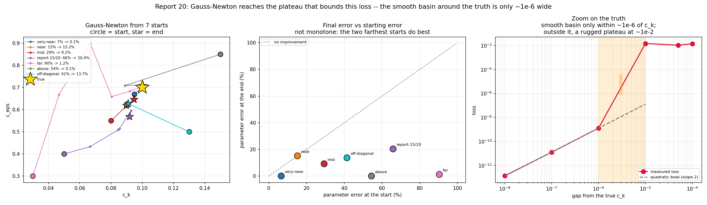
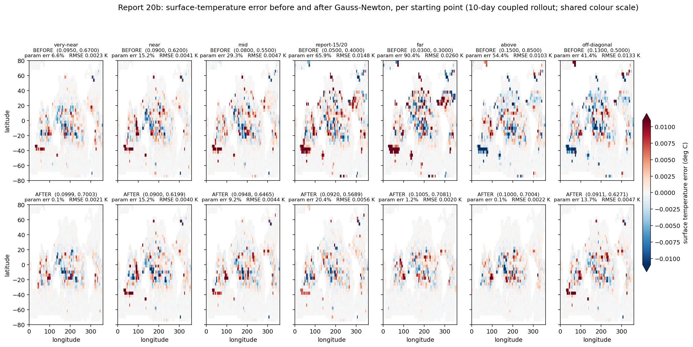

# Report 20b: Gauss-Newton Calibration

Follow-up to [report 20a](report-20a-coupled-calibration-demo.md), which fitted the same problem with adam and diagnosed why it stops short: not a local minimum, but a narrow diagonal `c_k`/`c_eps` valley in which `dL/dc_eps` points away from the truth along the entire path to it. That is a conditioning failure, and it says the fix is a better-conditioned step.

**Result: Gauss-Newton recovers `c_k` = 0.1000 and `c_eps` = 0.7004 against a truth of (0.1, 0.7) -- 0.1% parameter error, in 12 iterations.** adam reaches 19-24% in 100 iterations on the identical problem, and L-BFGS stalls in its line search.

## Method

The loss is a sum of squared residuals, `L = sum_i r_i^2` with `r = temp_surface - target` over the 2319 ocean cells, so with two parameters the Gauss-Newton step is available directly:

```
J      = [ dr/dc_k , dr/dc_eps ]        (n_cells x 2), from two forward-mode JVPs
step   = -(J^T J + lambda * diag(J^T J))^-1 J^T r
```

Two points make this cheap and principled here:

- **Two JVPs give the exact Jacobian.** With a 2-dimensional parameter space, forward-mode AD delivers `J` at the cost of roughly two forward runs -- no adjoint, no approximation. `J^T J` is the same 2x2 matrix [report 17](report-17-forward-sensitivity-identifiability.md) computes from forward-mode tangents.
- **Inverting `J^T J` is exactly the correction the valley needs**, and it is discovered from local information alone. Hard-coding the valley slope measured from a landscape scan would smuggle in knowledge of the answer; this does not.

Levenberg-Marquardt damping (`lambda`, adapted by a factor 3 down on acceptance and 5 up on rejection, up to 12 retries) handles the loss's ruggedness. Everything else -- model, 10-day rollout, loss, masking -- is identical to report 20a.

Script: `Results/Report/scripts/report-20/gn_multistart.py`.

*Implementation note*: `jax.jacfwd` returns `inf` columns on this model -- its internal `vmap` over the tangent basis hits something the coupled rollout does not survive. Two separate `jax.jvp` calls give correct columns at the same cost. Verified at the start point: `jacfwd` column norms are `(inf, inf)`, explicit JVPs give `(41.7, 10.6)` with `cond(J^T J)` = 24.

## Seven starting points



| start | from | distance | -> `c_k` | -> `c_eps` | final error | loss | iters |
|---|---|---|---|---|---|---|---|
| very-near | (0.095, 0.670) | 6.6% | 0.0999 | 0.7003 | **0.1%** | 9.98e-3 | 5 |
| near | (0.090, 0.620) | 15.2% | 0.0900 | 0.6199 | 15.2% | 3.77e-2 | 4 |
| mid | (0.080, 0.550) | 29.3% | 0.0948 | 0.6465 | 9.2% | 4.55e-2 | 8 |
| report-15/20a start | (0.050, 0.400) | 65.9% | 0.0920 | 0.5689 | 20.4% | 7.24e-2 | 10 |
| far | (0.030, 0.300) | 90.4% | 0.1005 | 0.7081 | **1.2%** | 9.29e-3 | 11 |
| above | (0.150, 0.850) | 54.4% | 0.1000 | 0.7004 | **0.1%** | 1.09e-2 | 12 |
| off-diagonal | (0.130, 0.500) | 41.4% | 0.0911 | 0.6271 | 13.7% | 5.13e-2 | 1 |

**The outcome is not monotone in starting distance.** The two *farthest* starts (90% and 54% away) do best, reaching 1.2% and 0.1%, while `near` -- only 15% away -- does not move at all, and the start used throughout reports 15 and 20a reaches only 20.4%.

The `near` stall is genuine rather than a bookkeeping artefact: `cond(J^T J)` there is a healthy 58-62, but every trial step *increases* the loss, so the damping search drives `lambda` from 1e-3 to 3.8e5 until the step is infinitesimal. The local linearisation holds only over a vanishingly small neighbourhood at that point.

## Error before and after, per start



| start | param error | surface temp RMSE |
|---|---|---|
| very-near | 6.6% -> 0.1% | 0.0023 -> 0.0021 K (1.10x) |
| near | 15.2% -> 15.2% | 0.0041 -> 0.0040 K (1.01x) |
| mid | 29.3% -> 9.2% | 0.0047 -> 0.0044 K (1.06x) |
| report-15/20a start | 65.9% -> 20.4% | 0.0148 -> 0.0056 K (2.65x) |
| far | 90.4% -> 1.2% | 0.0260 -> 0.0020 K (**12.99x**) |
| above | 54.4% -> 0.1% | 0.0103 -> 0.0022 K (4.76x) |
| off-diagonal | 41.4% -> 13.7% | 0.0133 -> 0.0047 K (2.82x) |

All panels share one colour scale, so the starts are comparable with each other and not only within a column.

Note that **RMSE reduction tracks the starting distance, not the final accuracy**. `far` improves 13x because it began badly; `very-near` improves only 1.10x despite ending at 0.1% error, because it began close. The after-panels look broadly alike regardless of whether the run ended at 0.1% or 15% parameter error -- which is the next section's point.

## What bounds the accuracy: a basin ~1e-6 wide

The best endpoint has 0.1% parameter error and a loss of 1.0e-2, while the loss *at* the truth is 0. Zooming along the segment between them (right-hand panel of the multistart figure):

| fraction to truth | gap in `c_k` | loss |
|---|---|---|
| 0.0 (GN endpoint) | 1e-4 | 1.387e-2 |
| 0.5 | 5e-5 | 1.064e-2 |
| 0.9 | 1e-5 | 1.466e-2 |
| **0.99** | **1e-6** | **1.281e-9** |
| 0.999 | 1e-7 | 1.247e-11 |
| 0.9999 | 1e-8 | 1.379e-13 |
| 1.0 | 0 | 0 |

**The smooth basin around the true parameters is about 1e-6 wide in `c_k`, roughly 0.001% relative.** Inside it the loss is a textbook quadratic bowl -- each 10x closer gives 100x lower loss. Outside it, from a gap of 1e-5 upward, the loss is a flat plateau at ~1.4e-2 carrying no information about which way the truth lies.

So the converged runs are **not at the truth; they are on the plateau, as close as the plateau allows**, and the residual 0.1% is irreducible by any local method. This also explains the scatter in the table above: the plateau spans `c_k` 0.09-0.10 and `c_eps` 0.57-0.71, so parameter errors anywhere between 0.1% and 20% give essentially the same loss. Which point on it a run reaches depends on its path, not its starting distance -- and it is why loss ranking and parameter ranking never agree in this series.

The plateau is the chaotic-decorrelation floor of [report 19](report-19-signal-to-floor.md) seen at 10 days: a parameter perturbation too small to matter physically still sends the coupled trajectory onto a different realisation, and the resulting field difference is what the plateau measures.

## Takeaway

1. **Gauss-Newton reaches the limit this loss allows** (1.0-1.4e-2, 0.1% parameter error) where adam stops above it at 4.6e-2 and 19-24%. The distinguishing ingredient is second-order information, obtained from two forward-mode JVPs rather than estimated from a history of gradients.
2. **A 2-parameter calibration should not use a first-order optimizer here.** Gauss-Newton costs ~2 forward runs per iteration and converges in about 10; adam cost 100 gradients and did worse.
3. **Accuracy is bounded by physics, not by the optimizer.** The ~1e-6 basin is set by chaotic decorrelation over the rollout. Reaching the true parameters exactly would require suppressing that -- a shorter rollout, ensemble averaging, or a time-averaged observable ([report 19](report-19-signal-to-floor.md)) -- not a better optimizer.
4. **Report success in parameter error, not loss.** On the plateau the two are unrelated: runs differing by 200x in parameter error share the same loss to within a factor of 5.
