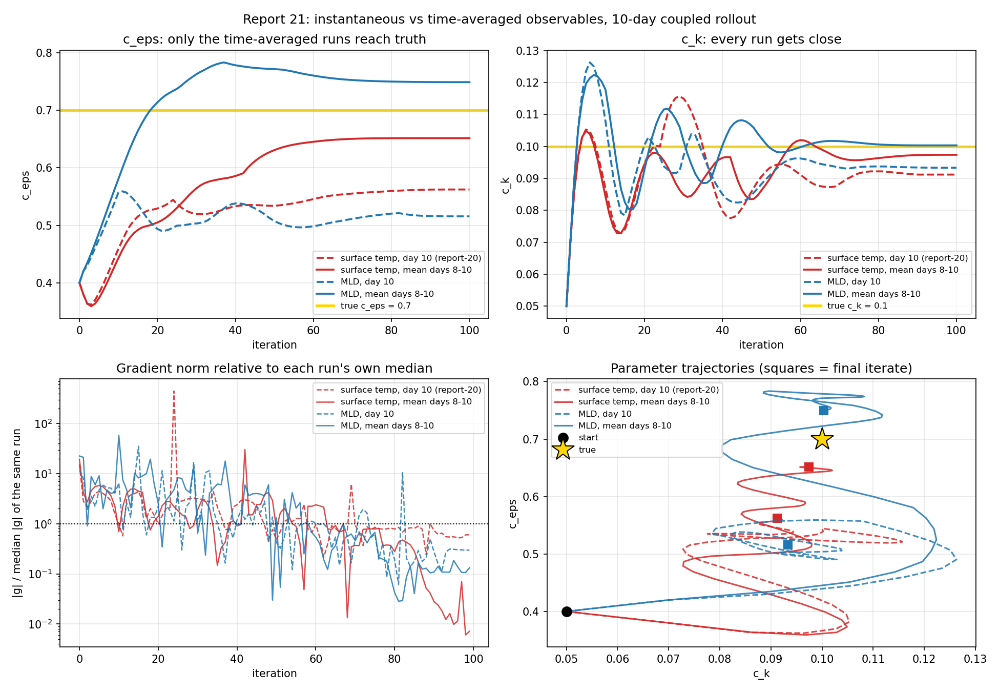
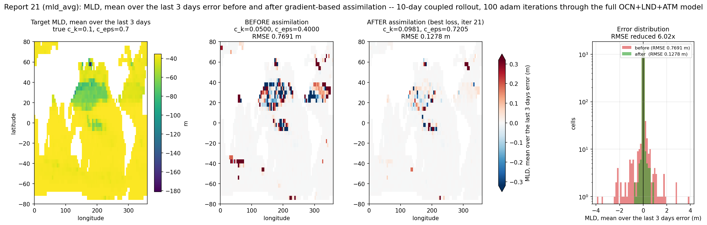
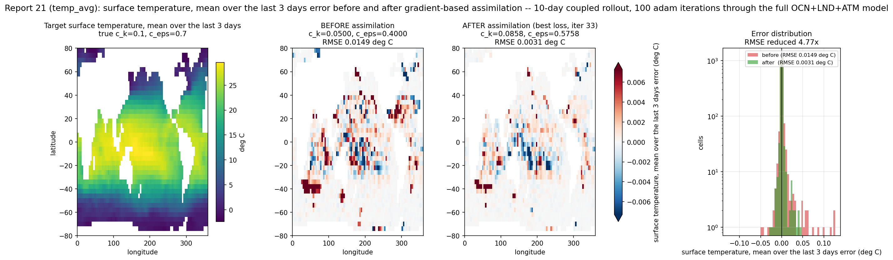
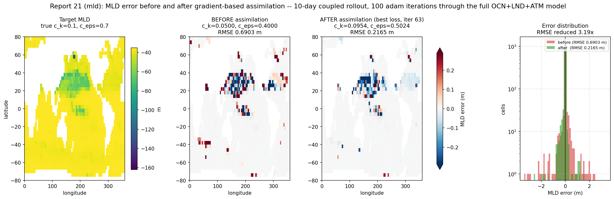

# Report 21: Time-Averaged Observables

Report-20 recovered `c_k` and `c_eps` from a 10-day coupled rollout but left `c_eps` 20% short of truth, and its descent was visibly noisy: the loss curve made 3-4x excursions above its running minimum, and an unclipped version of the same run hit a gradient some 200x its neighbours at iteration 24, which adam's momentum then carried for ~25 iterations.

This report asks whether the *observable* is responsible, by changing only the observable and holding report-20's recipe fixed. Two axes, four corners:

| | instantaneous (day 10) | averaged (days 8, 9, 10) |
|---|---|---|
| **surface temperature** | report-20 | `temp_avg` |
| **mixed layer depth** | `mld` | `mld_avg` |

Report-20 is the first corner; the other three are run here.

## Setup

| | |
|---|---|
| model | Veros ocean + JCM land + JAX-GCM atmosphere, coupled through VerCOR, global 4 deg |
| rollout | 10 days, daily coupling, `jax_enable_x64`, CPU |
| target | synthetic, generated at true `c_k` = 0.1, `c_eps` = 0.7 |
| initial guess | `c_k` = 0.05, `c_eps` = 0.40 |
| loss | `sum((observable - target)^2)` over the valid cells |
| gradient | `jax.value_and_grad` through the whole coupled rollout |
| optimizer | `optax.adam`, cosine-decay lr from 2e-2 to 0 over 100 iterations, gradient norm clipped |

Cells in the loss: 2319 surface ocean cells for both temperature observables, 2317 columns for instantaneous MLD, 2311 for averaged MLD (a column is kept only if its MLD is well defined on all three averaged days).

Scripts: `Results/Report/scripts/report-21/{common21,fit,validate_segmented,comparison}.py`. Run on Grid5000 grenoble, jobs 3096278/3096279/3096280, 90-137 s/iteration depending on the node.

### Chained rollout

The averaged observables need the day-8 and day-9 states, and `Coupler.run` returns only the final state. So the averaged runs split the rollout into three chained couplers -- days 0-8, 8-9, 9-10, each started at the date the previous one ended -- exactly as [report-6](report-6-windowed-optimization-with-lr-decay.md) chains its calibration windows. Chaining is plain function composition, so reverse-mode AD still differentiates all 10 days in one `value_and_grad` call.

That is only legitimate if handing a returned state to a coupler started at the next date reproduces the uninterrupted run. `validate_segmented.py` checks it before any fit is worth running:

| | max abs. difference | relative |
|---|---|---|
| day-10 surface temperature | 7.1e-15 K | 4.5e-16 |
| day-10 MLD | 9.3e-12 m | 2.4e-13 |

with no column changing its MLD-definedness. That is x64 roundoff, so the averaged runs integrate the same trajectory report-20 did.

### Clip threshold

Report-20 clipped the global gradient norm at 50. That number does not transfer: an MLD loss is carried in m^2 and a temperature loss in K^2, and their gradient norms here differ by four orders of magnitude, so a fixed 50 would clip an MLD run to nothing and never bind at all elsewhere. What transfers is the *ratio*: report-20's 50 sat at 1.2205 times the gradient norm at its own starting point (`dL/dc_k` = -4.096e1, `dL/dc_eps` = 9.704e-1, norm 40.97).

So each run here measures its gradient at the start point and clips at 1.2205 times that norm. The rule reproduces report-20's hand-picked value for report-20's observable -- `temp_avg` measured 48.1 against the 50 chosen by hand -- and gives 5.1e4 for `mld` and 6.4e4 for `mld_avg`. Clipping bound on 1, 2 and 1 iterations out of 100 respectively, so it is doing what report-20 intended: catching outliers, passing everything healthy.

## Parameter recovery

Final iterate (true `c_k` = 0.1, `c_eps` = 0.7):

| observable | `c_k` | `c_eps` |
|---|---|---|
| surface temp, day 10 ([report-20](report-20-coupled-calibration-demo.md)) | 0.0912 (8.8%) | 0.5624 (19.7%) |
| surface temp, mean days 8-10 | 0.0974 (2.6%) | **0.6517 (6.9%)** |
| MLD, day 10 | 0.0933 (6.7%) | 0.5156 (26.3%) |
| MLD, mean days 8-10 | **0.1003 (0.3%)** | **0.7492 (7.0%)** |

**The averaging is what moves `c_eps`, not the choice of observable.** Both averaged runs land within 7% of truth; both instantaneous runs stall in the 0.51-0.56 band, which is where every previous report in this series has stalled. Swapping temperature for MLD while staying instantaneous makes `c_eps` *worse* (26.3% against 19.7%), so MLD on its own is not the ingredient.

`c_k` was never the hard parameter -- all four runs get within 9%, and the averaged runs get within 3%.

### The degeneracy relaxes, but only for averaged MLD

Report-18 identified the `c_k`/`c_eps` degeneracy: the loss constrains the combination `c_eps - 8.9*c_k` far better than either parameter alone, so the lowest-loss iterate and the closest-to-truth iterate need not be the same point, and must not be quoted together. Pairing them by their own loss:

| observable | best-loss iterate | `c_k` | `c_eps` |
|---|---|---|---|
| surface temp, day 10 | 45 | 0.0807 (19.3%) | 0.5353 (23.5%) |
| surface temp, mean days 8-10 | 33 | 0.0858 (14.2%) | 0.5758 (17.7%) |
| MLD, day 10 | 63 | 0.0954 (4.6%) | 0.5024 (28.2%) |
| MLD, mean days 8-10 | 21 | **0.0981 (1.9%)** | **0.7205 (2.9%)** |

`mld_avg` is the only run in the series where selecting on the loss -- the only selection available on a real assimilation problem, since it uses no knowledge of the truth -- lands within 3% of both parameters. Everywhere else, including `temp_avg`, the best-loss iterate is markedly worse than the final one and the two still cannot be quoted together.

Note that `mld_avg`'s best loss falls at iteration 21, early in the descent, while the run then spends 80 iterations drifting from `c_eps` = 0.72 up to 0.78 and back down to 0.75. Both endpoints of that excursion are good; the loss simply does not resolve the difference.

## Does averaging stabilize the gradient?

Over all 100 iterations of each run:

| observable | max/median \|g\| | iterations above 10x median | consecutive-gradient sign reversals |
|---|---|---|---|
| surface temp, day 10 | 447x | 2 | 14 / 99 |
| surface temp, mean days 8-10 | **30.5x** | 2 | 12 / 99 |
| MLD, day 10 | 35.4x | 7 | 18 / 99 |
| MLD, mean days 8-10 | 58.4x | 8 | **9 / 99** |

**For surface temperature, yes, and decisively.** Same observable, same rollout, same optimizer: averaging three days shrinks the outlier tail 15-fold, from 447x the median to 30.5x. That tail is precisely report-20's pathology -- the one spike that made clipping necessary in the first place -- and averaging removes it rather than capping it.

**For MLD, no, but it fixes something else.** Averaging leaves the tail alone (35.4x to 58.4x, i.e. slightly worse) and instead halves the direction flapping: 18 sign reversals down to 9, the steadiest of the four. So "stabilize" is really two distinct defects, and the time average addresses a different one in each case -- temperature's isolated spikes, MLD's step-to-step incoherence.

What averaging does *not* do is smooth the loss curve. Its excursion above its own minimum grows, from 11.1x for report-20 to 22.8x (`temp_avg`) and 36.2x (`mld_avg`); `mld` is the flattest at 10.2x and also the worst-fitting. The parameters move smoothly regardless -- what improves is where the descent goes, not how quiet it looks.

## Error before and after

Each variant's own observable, mapped at the initial guess and at the fitted parameters, over the columns valid in all four rollouts (2317 for `mld`, 2319 for `temp_avg`, 2311 for `mld_avg`). Script: `snapshots.py`, job 3096505.

| variant | before | best-loss iterate | final iterate |
|---|---|---|---|
| surface temp, day 10 ([report-20](report-20-coupled-calibration-demo.md)) | 0.0148 K | 0.0044 K (3.3x) | 0.0058 K (2.6x) |
| surface temp, mean days 8-10 | 0.0149 K | **0.0031 K (4.77x)** | 0.0056 K (2.65x) |
| MLD, day 10 | 0.6903 m | 0.2165 m (3.19x) | 0.2673 m (2.58x) |
| MLD, mean days 8-10 | 0.7691 m | **0.1278 m (6.02x)** | 0.1897 m (4.05x) |

Only the reduction factors compare across rows -- the four "before" columns are four different fields in two different units, and the MLD variants do not even share a domain. As a check on the diagnostics, `mld`'s before value of 0.6903 m is identical to the MLD error report-20 reported at the same initial parameters.

### Averaged MLD

`mld_avg` gives both the largest field-error reduction of the four (6.02x) and the closest parameters, at the same iterate. The residual error is concentrated in the 20-40N subtropical band and an equatorial Pacific strip -- the same regions report-20 was left with, and where [report-17](report-17-forward-sensitivity-identifiability.md)'s forward-mode maps put the `c_eps` sensitivity -- but at roughly a third of report-20's amplitude.

### Averaged surface temperature

`temp_avg` is where the [report-18](report-18-stratification-loss.md) degeneracy is sharpest anywhere in this series. Its best-loss iterate fits the field 1.8x better than its final iterate (4.77x against 2.65x) while sitting three times further from truth in both parameters (14.2%/17.7% against 2.6%/6.9%). Both statements describe the same run, and the two must not be quoted together.

That also qualifies the headline: at the final iterate `temp_avg` reduces field error 2.65x against report-20's 2.6x, i.e. not at all. **Averaging bought better parameters, not a better fit to its own observable.**

### Instantaneous MLD

Fitting instantaneous MLD directly (3.19x) barely beats the 2.47x that report-20 got on MLD *for free*, as an untrained diagnostic of a surface-temperature fit -- and it does so while ending 26.3% off on `c_eps` against report-20's 19.7%. Directly optimising an observable is worth surprisingly little here if it is not also averaged.

## What this does and does not show

**It shows** that a three-day time average of the observable, at no extra rollout cost, takes `c_eps` from ~20-26% error to ~7% in the coupled 10-day fit, and that with averaged MLD both parameters land within 3% at the iterate a real assimilation would actually select -- an iterate that also cuts field error 6.02x, the largest reduction in the series. It also shows that report-20's gradient spikes come from the instantaneous surface-temperature observable and not from the coupled model's gradient as such: the same rollout, read three days at a time, does not produce them.

**It does not show** that the two axes are independent. Averaged MLD beats averaged temperature on `c_k` (0.3% against 2.6%) and on the best-loss iterate by a wide margin, so the observable does matter once averaging is in place -- it just does not help without it.

**Each corner is one run, with no error bar.** These runs are deterministic -- rerunning one reproduces it exactly -- so the missing measurement is not sampling noise but sensitivity to perturbations that ought to be irrelevant: a slightly different start point, a different iteration budget, a different node whose thread count changes floating-point summation order. On a chaotic model those do not stay small; [report-7](report-7-identifiability-alt-start.md) took report-6's windowed recipe -- a different recipe from this one, but the same model and parameters -- changed only the starting corner, and finished at (0.071, 0.962) against (0.169, 0.503). Note also that `mld_avg` ran at 90 s/iteration against 137 s/iteration for the other two, so it did not share a node with them.

The parameter differences are far too large to be explained that way -- `c_eps` at 0.5156 against 0.7492 is not a roundoff story. The gradient statistics are another matter: differences within a factor of two, `mld` at 35.4x against `mld_avg` at 58.4x say, are inside the range that an unmeasured start-point sensitivity could plausibly cover, and should not be read as significant. Establishing that would take the same corner run from two or three nearby start points.

**Instantaneous MLD at 10 days is worse than at 20.** [Report-16](report-16-mld-loss.md) reached `c_eps` = 0.633 with the same observable at N=20; here at N=10 it reaches 0.5156. So report-20's finding that a shorter rollout helps does not carry over to MLD. That comparison is not clean -- report-16 ran 30 iterations without clipping -- but it is the opposite sign to what [report-19](report-19-signal-to-floor.md)'s signal-to-floor argument predicts, and worth a dedicated run before it is trusted either way.

## Related results

- [report-20](report-20-coupled-calibration-demo.md) is the baseline corner; its before/after maps use the same script and layout, so the panels compare directly.
- [report-19](report-19-signal-to-floor.md) predicted time-averaged MLD as the best observable available, and named it the best *long-rollout* option specifically: it measured a 17x signal-to-floor gain from averaging at N=20, and found that at N=10 there is effectively no floor at all (a 30% `c_eps` error is ~1e9 times louder than a 1e-5 perturbation). Its ranking of the observables is confirmed here, but at a rollout length where its stated mechanism should not apply -- averaging bought most of the `c_eps` recovery at N=10, where there was no floor for it to suppress. Whatever the averaging is doing here, the decorrelation floor is not it.
- [report-18](report-18-stratification-loss.md) is the source of the `c_k`/`c_eps` degeneracy that the averaged MLD loss finally relaxes.
- [report-16](report-16-mld-loss.md) contributed the MLD kernel used here unchanged.

The natural follow-ups are a longer averaging window, since three days was chosen only because it is the shortest window that is not instantaneous and nothing here suggests three is optimal; a rerun of one corner from two or three nearby start points, to put a bar on the gradient statistics; and instantaneous MLD at N=20 under this report's 100-iteration clipped recipe, to settle whether the N=10 result really is worse than report-16's.
