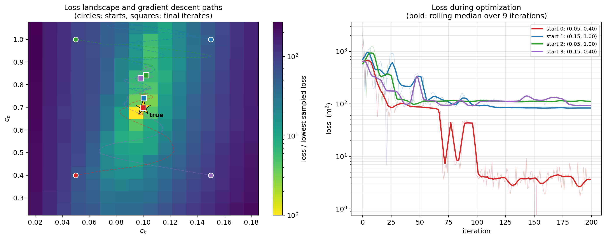
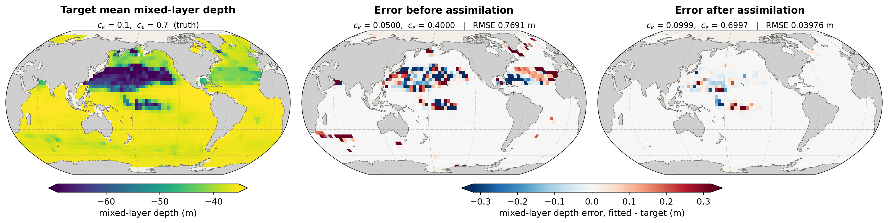
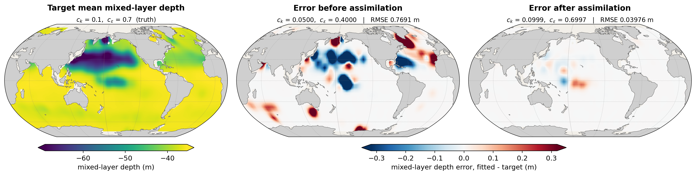

# Report 22: Loss Landscape and Multistart Recovery with the Time-Averaged MLD Loss

[Report-21](report-21-time-averaged-observables.md) found that averaging the mixed-layer depth over the last three days of a 10-day coupled rollout recovered `c_eps` far better than any observable tried before it. This report maps the loss surface that result sits on, and asks the question a single descent cannot answer: does gradient descent through the coupled model find the true parameters, or does it find whatever point it happens to start near?

Four descents from pre-registered starting corners, on a 256-node scan of the same loss.

## Setup

| | |
|---|---|
| model | Veros ocean + JCM land + JAX-GCM atmosphere, coupled through VerCOR, global 4 deg |
| rollout | 10 days, daily coupling, `jax_enable_x64`, CPU |
| observable | mixed-layer depth, averaged over the day-8, day-9 and day-10 states |
| loss | `sum((mld_avg - target)^2)` over the 2311 columns with a well-defined MLD |
| target | synthetic, generated at true `c_k` = 0.1, `c_eps` = 0.7 |
| gradient | `jax.value_and_grad` through the whole coupled rollout |
| optimizer | `optax.adam`, cosine-decay lr from 2e-2 to 0, gradient norm clipped at 1.2205x the start-point norm |

The recipe is report-21's `mld_avg` run unchanged; only the start point and the iteration count vary. The rollout is three chained couplers (days 0-8, 8-9, 9-10) so the average can see the intermediate states, verified in report-21 to reproduce a monolithic 10-step run to roundoff.

Scripts: `Results/Report/scripts/report-21/{landscape_grid,merge_grid,fit,snapshots,paper_figures}.py`. Grid jobs 3096522-25 (~25 min each, 4 in parallel, 23 s per node); descents 3096526-28 and 3096730-33 (~136 s/iteration). Raw data in `figures/report-21-paper/` (grid) and `figures/report-21-paper200/` (descents, fields).

### The starts were fixed before the runs

The four starts are the corners of a box centred on the true parameters -- `c_k` = 0.1 plus or minus 50%, `c_eps` = 0.7 plus or minus 0.3:

| start | `c_k` | `c_eps` |
|---|---|---|
| 0 | 0.05 | 0.40 |
| 1 | 0.15 | 1.00 |
| 2 | 0.05 | 1.00 |
| 3 | 0.15 | 0.40 |

Start 0 is the canonical start used throughout this series, fixed long before this experiment; the other three are its mirror images about truth. They were chosen and launched before the landscape was drawn, and all four are reported. A multistart figure whose starts were picked after seeing where the descents go would show nothing.

The clip threshold is measured at each start point rather than fixed, so it is 6.0e4, 1.4e5 and 6.8e4 for starts 1-3 against 6.4e4 for start 0. That is report-21's rule -- report-20's hand-picked 50 expressed as a multiple of the start-point gradient norm -- and not a per-run tuning knob. All four descend the identical loss over the identical 2311 columns, so their loss curves are directly comparable.

## The landscape

A 16x16 forward-only scan over `c_k` in [0.02, 0.18] and `c_eps` in [0.25, 1.05]: 256 rollouts, no gradients. The grid's lowest node is `c_k` = 0.0947, `c_eps` = 0.6767 at loss 21.2 -- the node nearest truth, within half a cell in both directions (spacing 0.0107 and 0.0533).

**The minimum is a closed basin on the true parameters, not a diagonal valley.** That matters because every previous report in this series has been limited by the [report-18](report-18-stratification-loss.md) degeneracy, in which the loss constrains the combination `c_eps - 8.9*c_k` much better than either parameter alone and a fit can slide along a ridge of equally good points. Averaging the observable substantially removes it: `c_k` is pinched hard around 0.10 and `c_eps` is genuinely constrained.

Searching the grid for local minima finds exactly two:

| | `c_k` | `c_eps` | loss |
|---|---|---|---|
| global | 0.0947 | 0.6767 | 21.2 |
| secondary | 0.1053 | 0.9433 | 107.6 |

The secondary minimum is a shallow dip in an otherwise flat shelf at high `c_eps`, five times worse in loss than the true basin. It is the reason two of the four descents do not recover `c_eps`.

**The grid is coarse relative to the basin.** Its best node is 21.2, while the descents reach 3.65 and touch 9.3e-6 -- so the scan at `c_eps` spacing 0.053 does not resolve the floor of the funnel it is drawing. The colour scale is normalised by the lowest *sampled* loss for that reason, and paths legitimately run below it.

## Multistart at report-21's budget

100 iterations, report-21's setting:

| start | final `c_k` | final `c_eps` | final loss |
|---|---|---|---|
| 0 (0.05, 0.40) | 0.1003 (0.3%) | 0.7492 (7.0%) | **83** |
| 1 (0.15, 1.00) | 0.1012 (1.2%) | 0.8347 (19.2%) | 112 |
| 2 (0.05, 1.00) | 0.1042 (4.2%) | 0.8604 (22.9%) | 114 |
| 3 (0.15, 0.40) | 0.0927 (7.3%) | 0.5360 (23.4%) | 185 |

`c_k` comes back from every corner. `c_eps` does not: starts 1 and 2 sit in the secondary minimum's shelf, start 3 is still climbing toward truth from below with its gradient pointing the right way and the cosine schedule already at zero. That mixture -- one run out of budget, two in the wrong basin -- is what motivated doubling the budget.

## Multistart at 200 iterations

`decay_steps` follows the iteration count, so this is a gentler schedule rather than a continuation, and all four corners were rerun to keep the set internally comparable.

| start | final `c_k` | final `c_eps` | final loss | lowest loss (iterate) |
|---|---|---|---|---|
| 0 (0.05, 0.40) | **0.0999 (0.1%)** | **0.6997 (0.04%)** | **3.65** | 9.3e-6 (151) |
| 1 (0.15, 1.00) | 0.1003 (0.3%) | 0.7412 (5.9%) | 83.6 | 81.2 (164) |
| 2 (0.05, 1.00) | 0.1020 (2.0%) | 0.8429 (20.4%) | 112 | 91.4 (48) |
| 3 (0.15, 0.40) | 0.0981 (1.9%) | 0.8290 (18.4%) | 93.8 | 6.82 (21) |

**Start 0 recovers both parameters.** 0.0999 and 0.6997 against 0.1 and 0.7 -- 0.1% and 0.04% error, from a start 50% and 43% wrong, by differentiating a coupled ocean-atmosphere-land model end to end. Its lowest-loss iterate reaches 9.3e-6, which working back through the curvature puts within about 5e-7 of the true `c_eps`; that is a lucky single sample rather than the converged state, and the converged numbers above are the ones to quote.

**Start 1 escapes with the longer budget** (0.8347 to 0.7412), so the high-`c_eps` shelf is not a trap that holds everything entering it. **Start 2 does not**, from the same `c_eps` = 1.00 but the opposite `c_k` corner: its best iterate is at iteration 48 and it goes no further in the remaining 150.

**Start 3 reaches truth and leaves again.** At iteration 21 it is at (0.0969, 0.6737), 3.1% and 3.8% error, loss 6.82 -- lower than any node on the grid. It then climbs to `c_eps` = 0.829 and finishes on the wrong shelf. The descent does not park on the best point it visits, so its endpoint on the landscape is not where it came closest to truth; the lowest-loss iterate of each run is tabulated above rather than marked on the figure.

**The loss ranks the runs correctly.** 3.65 for the run that recovered the parameters against 83.6, 112 and 93.8 for the three that did not -- a 23x gap, using no knowledge of the truth. Selecting the lowest-loss restart is the choice available on a real calibration problem, and here it selects the right one.

## Error before and after

Start 0's converged parameters, over the 2311 columns with a well-defined MLD in every rollout:

| | mean MLD RMSE |
|---|---|
| before (`c_k` = 0.05, `c_eps` = 0.40) | 0.7691 m |
| after (`c_k` = 0.0999, `c_eps` = 0.6997) | **0.0398 m** |
| reduction | **19.3x** |

The residual sits in the 20-40N subtropical band and an equatorial Pacific strip, which is where [report-17](report-17-forward-sensitivity-identifiability.md)'s forward-mode maps put the `c_eps` sensitivity.

The figure uses the **converged** iterate, not the lowest-loss one. The lowest-loss iterate gives 0.0001 m, a 12105x reduction and a blank map, but it is the single lucky sample described above; 19.3x is the honest figure for the converged state and leaves visible structure a reader can check.

## What this shows and does not show

**It shows** that reverse-mode AD through a coupled ocean-atmosphere-land model produces gradients good enough to recover two TKE closure parameters to sub-percent accuracy from a 50%-wrong start, and that the resulting field error falls 19x. Every gradient comes from one `jax.value_and_grad` call over the whole coupled system; no adjoint was written by hand.

**It does not show** recovery from anywhere. Two of four corners end 18-20% off in `c_eps`, held by a shallow secondary minimum at high `c_eps` that the landscape resolves. The honest summary is that this loss has a well-defined global basin at truth plus one spurious basin, and that a multistart with lowest-loss selection distinguishes them by a factor of 23 in loss.

**The budget was chosen after seeing the 100-iteration runs.** The starts were pre-registered and none were discarded, but 100 iterations was inherited from report-20 and 200 was set once, after observing that start 3's gradient still pointed at truth with the schedule exhausted. It was then applied to all four corners and not revisited.

**`c_eps` accuracy is not uniform across the basin.** Start 1 converges to 0.7412 and start 0 to 0.6997, both stably, with losses 83.6 and 3.65. The loss separates them, but a run stopping at 0.74 would look converged on its own trajectory.

**Single runs.** As in report-21, each corner is one deterministic run; there is no measurement of how much a nominally irrelevant perturbation -- a start point 5% away, a different node's summation order -- would move these endpoints.

## Related results

- [report-21](report-21-time-averaged-observables.md) established the observable and found `c_eps` = 0.7492 from start 0 at 100 iterations; the same start at 200 iterations gives 0.6997, so that result was budget-limited rather than converged.
- [report-18](report-18-stratification-loss.md) is the source of the `c_k`/`c_eps` degeneracy that this landscape shows to be substantially relaxed by time averaging.
- [report-19](report-19-signal-to-floor.md) predicts no chaotic decorrelation floor at N=10, which the 9.3e-6 loss confirms directly: the funnel bottoms out at zero rather than on a noise floor.
- [report-8](report-8-ck-ceps-coupled-fit-n20-classical.md) and report-18 ran the same grid-plus-multistart design on earlier observables, on overlapping `c_k` and `c_eps` ranges.

The obvious follow-ups are a refined grid near truth, since the current scan under-resolves the basin by an order of magnitude in `c_eps`; and a start-point sensitivity test, two or three descents from points a few percent apart, to put a bar on the endpoints.
