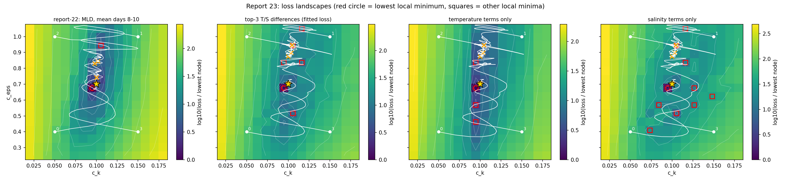
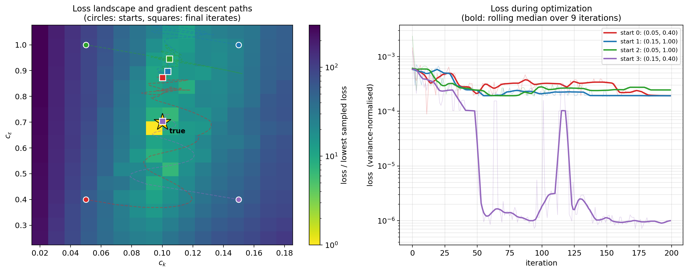
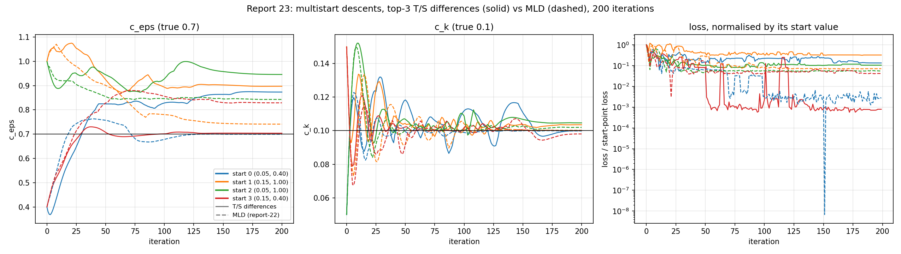
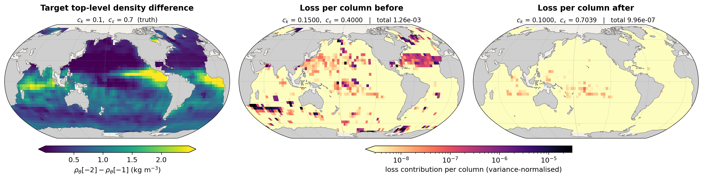

# Report 23: Top-3 Temperature/Salinity Differences as a Replacement for the MLD Loss

[Report-22](report-22-landscape-and-multistart.md) calibrated `c_k`/`c_eps` against the mixed-layer depth averaged over days 8-10 and found a closed basin at truth plus one spurious minimum on a high-`c_eps` shelf. This report asks what that MLD actually measures on this grid, and whether fitting the temperature and salinity structure of the top three levels directly -- the information the MLD is computed from -- is a better calibration target. Same grid, same four pre-registered corners, same 200-iteration recipe; only the observable changes.

## What the MLD measures on this grid

The MLD kernel (report-16's `get_index_mld` / `mld_from_index`) takes the reference density at the deepest level shallower than -10 m. On this 15-level grid the T-points are

```
zt = [..., -265, -175, -65, -35]      interfaces zw = [..., -120, -50, 0]
```

so every T-point is deeper than -10 m and the reference level is the surface cell itself (report-16 already noted this). The MLD is then the interpolated depth where `prho` first exceeds `prho[-1] + 0.03`. Reading off which pair of levels brackets the target MLD in report-22's saved fields (2311 columns):

| bracketing levels | columns |
|---|---|
| -35 / -65 m (levels -1 / -2) | 2205 (95.4%) |
| -65 / -175 m (levels -2 / -3) | 105 |
| deeper | 1 |

Only 8 columns change bracket between the initial guess and the target. In the top bracket the kernel reduces exactly to

```
mld = zt[-1] - 0.03 * (zt[-1] - zt[-2]) / (prho[-2] - prho[-1])
    = -35 - 0.9 / d12            (m, d12 in kg/m^3)
```

so for 95% of columns the "MLD" is a transformed density jump across the -50 m interface, not a mixed-layer depth. The target's median sits 1.29 m below -35 m (implied median `d12` = 0.70 kg/m^3), which is why report-22's MLD RMSEs (0.77 m before, 0.04 m after) are small against a 30 m level spacing. The 106 deeper-bracket columns are almost all at 20-40N (northern winter at this January start); they are 4.6% of the columns but carry 63% of the loss at start 0's initial guess.

On this grid, then, the MLD is a function of temperature and salinity at the top three levels only. A loss on those fields directly sees at least the same information, without the density combination (in which T and S partly cancel) and without the `1/d12` transform.

## Observable

`REPORT21_OBS=tsdiff_avg`: four vertical differences to the surface level, each averaged over the day-8, day-9 and day-10 states,

```
T[-2] - T[-1],   T[-3] - T[-1],   S[-2] - S[-1],   S[-3] - S[-1]
```

Differences rather than level values: the TKE closure acts on vertical structure, while level values are dominated by the surface-flux common mode. The loss is the sum of the four channels' squared errors, each weighted by `1/(n_c * var_c)` with `n_c` and `var_c` the cell count and spatial variance of the *target* channel (report-17's variance normalisation):

```
loss = sum_c  (1 / (n_c * var_c)) * sum_cells (x_c - target_c)^2
weights = [1.09e-4, 2.98e-5, 2.49e-3, 1.40e-3]      (T12, T13, S12, S13)
```

The weights depend on the target only, so every grid node and every descent evaluates the identical loss. The loss domain is the static wet mask (level -2 wet for the `-2` channels, level -3 for the `-3` channels; 9134 cells over the four channels), so, unlike the MLD, no column enters or leaves the loss as the parameters move.

A forward-mode screen on report-17's saved tangents (N=20, instantaneous, three evaluation points) motivated the choice: the T/S differences had the same conditioning as the MLD at truth (`cond` 14.0 vs 14.4) and much better at report-17's initial and stall points (3.5 vs 39.6, 12.3 vs 30.5), while their curvature per unit spatial variance was lower. That screen is local and was run in a different regime, and as shown below it did not predict the multistart outcome.

## Setup

| | |
|---|---|
| model | Veros ocean + JCM land + JAX-GCM atmosphere, coupled through VerCOR, global 4 deg |
| rollout | 10 days, daily coupling, `jax_enable_x64`, CPU; three chained couplers (days 0-8, 8-9, 9-10) as in report-21 |
| observable | top-3 T and S differences to the surface level, averaged over days 8-10 |
| loss | variance-normalised SSE above, 9134 cells over four channels |
| target | synthetic, generated at true `c_k` = 0.1, `c_eps` = 0.7 |
| optimizer | `optax.adam`, cosine-decay lr from 2e-2 to 0 over 200 iterations, gradient norm clipped at 1.2205x the start-point norm |
| starts | report-22's four pre-registered corners, unchanged |

Everything except the observable is report-22's final recipe, fixed before these runs. Only the 200-iteration set was run; report-22's 100-iteration set was superseded by it.

Scripts: `Results/Report/scripts/report-21/{common21,fit,landscape_grid,merge_grid}.py` (observable `tsdiff_avg` added), job scripts and figures in `Results/Report/scripts/report-23/` (`snapshots_tsdiff.py` + `job_snapshots.sh` for the snapshot fields, `figure_snapshot.py`, `figure_landscape_multistart.py`, `descents_compare.py` and `landscape_compare.py` to draw the figures). Grid jobs 3097280-83 (~25 min each, 23.6 s per node); descents 3097284-87 (~134 s/iteration; 90 s on start 1's node); snapshot job 3098108. Raw data in `figures/report-23-tsdiff-paper/` (grid, including the per-channel losses) and `figures/report-23-tsdiff-paper200/` (descents).

## The landscape



Same 16x16 forward-only scan as report-22 (`c_k` in [0.02, 0.18], `c_eps` in [0.25, 1.05]). Each panel is normalised by its own lowest node. The MLD panel carries report-22's descents, the other three carry this report's.

| | MLD (report-22) | T/S differences |
|---|---|---|
| lowest node | (0.0947, 0.6767) | (0.0947, 0.6767) |
| dynamic range | 271x | 299x |
| local minima | 2 | 6 |
| best secondary | 5.1x, at (0.1053, 0.9433) | 6.8x, at (0.1053, 0.5167) |

Local minima of the T/S loss (nodes strictly below all 8 neighbours):

| `c_k` | `c_eps` | loss | vs lowest |
|---|---|---|---|
| 0.0947 | 0.6767 | 2.38e-5 | 1.00x |
| 0.1053 | 0.5167 | 1.61e-4 | 6.8x |
| 0.1160 | 0.8367 | 2.05e-4 | 8.6x |
| 0.1053 | 0.9433 | 2.44e-4 | 10.3x |
| 0.0947 | 0.8367 | 2.47e-4 | 10.4x |
| 0.1160 | 1.0500 | 2.72e-4 | 11.4x |

**The global basin is the same.** Both losses put their lowest node on the node nearest truth, with a similar dynamic range.

**The surface is bumpier.** Six local minima against two. Each spurious one is shallower relative to the global minimum than the MLD's (6.8-11.4x vs 5.1x), but there are more of them. Four of them, including the exact node of the MLD's secondary minimum, lie on the same high-`c_eps` shelf (`c_eps` 0.84-1.05). The shelf is therefore not an artefact of the MLD kernel; it is present in the raw T/S structure the MLD is computed from.

**Temperature and salinity constrain different parameters.** The temperature-only landscape has all four of its local minima at `c_k` = 0.0947, spread along `c_eps` from 0.46 to 0.84 with secondaries only 2.7-3.8x the lowest node: temperature pins `c_k` and leaves a valley in `c_eps`. The salinity-only landscape has the deepest basin (480x range) but ten local minima, all at least 7.8x the lowest: salinity carries the `c_eps` information and most of the roughness. One of its minima, at (0.0733, 0.41), sits next to start 0.

## Multistart at 200 iterations



Report-22's figure 1 for this loss: the same scan with the four descents on it, and their loss curves. Unlike report-22's, the loss axis is not clipped -- start 3's fall to ~1e-6 is its converged state, not a single lucky iterate.



Parameters against iteration, this loss (solid) against report-22's MLD runs (dashed).

| start | final `c_k` | final `c_eps` | final loss | lowest loss (iterate) | MLD final (report-22) |
|---|---|---|---|---|---|
| 0 (0.05, 0.40) | 0.1000 (0.0%) | 0.8733 (24.8%) | 1.93e-4 | 8.9e-5 (11) | **0.0999 / 0.6997** |
| 1 (0.15, 1.00) | 0.1035 (3.5%) | 0.8972 (28.2%) | 1.92e-4 | 1.86e-4 (150) | 0.1003 / 0.7412 |
| 2 (0.05, 1.00) | 0.1047 (4.7%) | 0.9458 (35.1%) | 2.45e-4 | 1.88e-4 (72) | 0.1020 / 0.8429 |
| 3 (0.15, 0.40) | **0.1000 (0.0%)** | **0.7039 (0.6%)** | **9.96e-7** | 7.1e-7 (172) | 0.0981 / 0.8290 |

**Start 3 recovers both parameters**: 0.1000 and 0.7039, from a start 50% and 43% wrong. Its final loss is 24x below the grid's lowest node, the same under-resolved funnel report-22 saw.

**The other three end on the high-`c_eps` shelf**, at 0.87-0.95. That is further from truth than report-22's three MLD failures (0.74-0.84).

**Which corner succeeds depends on the observable.** With the MLD it was start 0 that recovered truth and start 3 that finished on the shelf; here it is the reverse. Start 0's gradient at the start point has `dL/dc_eps` = +1.3e-3, pointing `c_eps` *down*: it first dips to 0.37, then climbs through truth around iteration 40 without stopping and parks at 0.87. Its lowest-loss iterate is iteration 11, at `c_eps` = 0.49, before it ever reached truth.

**`c_k` comes back from every corner** (0.1000-0.1047), as with the MLD.

**The loss ranks the runs correctly, and by a wider margin.** 9.96e-7 for the run that recovered the parameters against 1.92e-4 to 2.45e-4 for the three that did not: a 193x gap, against the MLD's 23x. Lowest-loss selection among restarts picks the right run with either observable.

Gradient behaviour per run (norm and direction over the 200 iterations):

| start | clip threshold | clipped iterations | max / median gradient norm | sign reversals |
|---|---|---|---|---|
| 0 | 7.8e-2 | 3 | 94x | 36 / 199 |
| 1 | 1.6e-2 | 20 | 184x | 51 / 199 |
| 2 | 8.2e-2 | 1 | 36x | 45 / 199 |
| 3 | 2.1e-2 | 7 | 250x | 38 / 199 |

Start 3's loss curve shows the cost of that roughness: after reaching ~1e-3 of its start value at iteration 55 it jumps back to ~1e-1 several times between iterations 60 and 115 before settling.

## What the loss measures, and where it is wrong



Start 3's rollouts at truth, at its initial guess and at its converged parameters, over the 2319 columns with a wet level -2. The left panel is the target's top-level density difference `d12 = prho[-2] - prho[-1]`, averaged over days 8-10: the quantity report-22's MLD is a transform of (`mld = -35 - 0.9/d12`) and the thing the T and S channels resolve into their two components. It ranges from -0.14 to 4.19 kg/m^3 with a median of 0.66; the large values sit in the equatorial Pacific and Atlantic cold tongues, the Indian monsoon region and the western boundary currents, while the subtropical gyres and the high latitudes are nearly unstratified across the top interface.

The other two panels map each column's contribution to the fitted loss, on a shared log scale:

| | total loss | top 1% of columns |
|---|---|---|
| before (`c_k` = 0.15, `c_eps` = 0.40) | 1.2627e-3 | 75% of the loss |
| after (`c_k` = 0.1000, `c_eps` = 0.7039) | **9.958e-7** | 41% of the loss |
| reduction | **1268x** | |

These totals are the loss `fit.py` descends, recomputed from the saved fields: 1.2627e-3 reproduces the start-point loss and 9.958e-7 the final iterate, to every printed digit.

**The loss is carried by a few percent of columns.** Before calibration, 1% of the columns hold three quarters of it: the Southern Ocean band at 40-60S, the Gulf Stream and Kuroshio separations, the Agulhas retroflection and a North Atlantic patch. These are where `d12` is both large and sharply structured, so a wrong mixing rate misplaces a front rather than shifting a smooth field. Calibration removes that structure entirely; what remains is a faint equatorial Pacific and Indonesian strip, four orders of magnitude weaker, which is where report-17's forward-mode maps put the `c_eps` sensitivity and where report-22's MLD residual also sat.

**The concentration is a caveat, not a result.** With 1% of columns carrying most of the signal, the loss is effectively an average over a few dozen frontal columns, which is the same weakness report-16 flagged for the MLD on this grid. It is also why the salinity terms are rough: fronts move discretely on a 4 deg grid.

## What this shows and does not show

**It shows** that on this grid the MLD loss is, for 95% of columns, a loss on `1/(prho[-2] - prho[-1])`, and that replacing it with the underlying T/S differences keeps the global basin at truth, keeps the ability to recover both parameters from some corner, and sharpens the separation between the recovering run and the rest (193x vs 23x). It does not improve the recovery rate: one corner out of four, as with the MLD.

**The high-`c_eps` shelf is a property of the model's response, not of the MLD.** It appears in the T/S landscape at the same nodes, and three of four descents end on it. A different observable built from the same three levels does not remove it.

**The local screen did not predict the global result.** Report-17's tangents gave the T/S differences an 11x conditioning advantage at the initial point. The landscape shows why that did not translate: conditioning is a two-number summary of the curvature at one point and cannot see the shelf or the salinity roughness. This is the same lesson as report-18.

**Single deterministic runs, one weighting.** Each corner was run once. The four channel weights are one choice (equal normalised contributions); a different T/S balance -- for example down-weighting the rough salinity terms -- would give a different landscape, and was not tried. The grid resolves neither basin's floor (spacing 0.0107 in `c_k`, 0.0533 in `c_eps`) nor minima narrower than one cell, so the minima count is a lower bound on the roughness at this resolution, and some of the listed minima may be grid noise.

**Verdict.** As a calibration target the top-3 T/S differences are roughly equivalent to the MLD, not better: the same basin and the same recovery rate, a sharper lowest-loss selection, but a rougher surface and larger `c_eps` errors when a run fails. The MLD's advantage, if any, is that its `1/d12` weighting smooths over the salinity roughness.

## Related results

- [report-22](report-22-landscape-and-multistart.md): the MLD landscape and multistart this report replicates with a different observable.
- [report-16](report-16-mld-loss.md): the MLD kernel, and the first note that the reference level is the surface cell on this grid.
- [report-17](report-17-forward-sensitivity-identifiability.md): the forward-mode tangents used to screen the observable, and the finding that T and S gradients beat density ones locally.
- [report-18](report-18-stratification-loss.md): a temperature-only stratification loss at N=20, where good local curvature also failed to translate into recovery.

The natural follow-ups are a multistart with the temperature and salinity terms re-weighted (temperature pins `c_k` cleanly, salinity carries `c_eps` but most of the roughness), and a joint T/S + MLD loss, which would combine the MLD's smoothing with the T/S loss's sharper selection.
