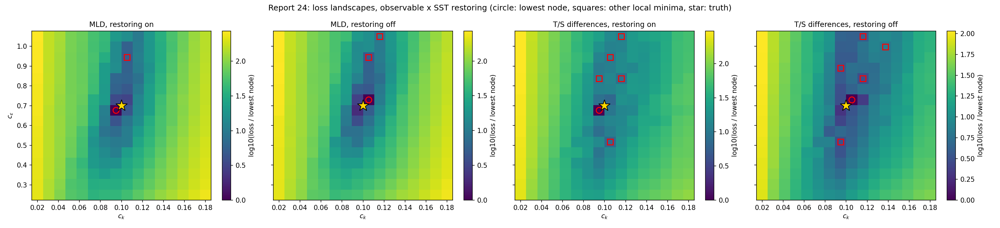
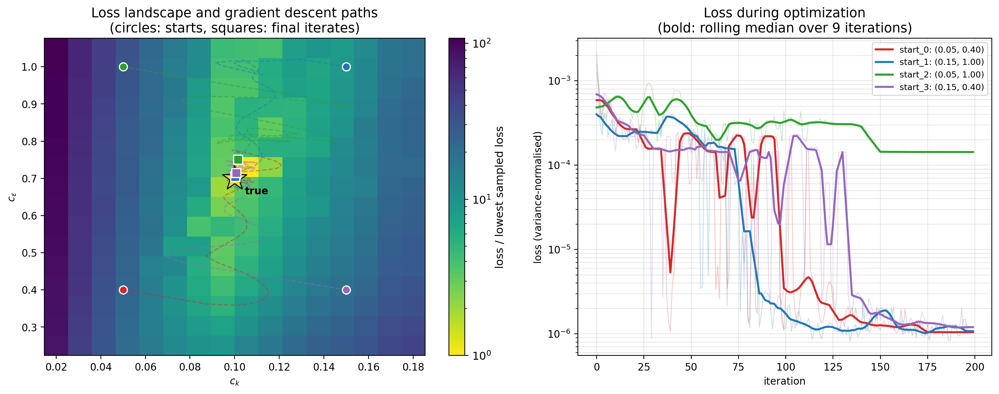
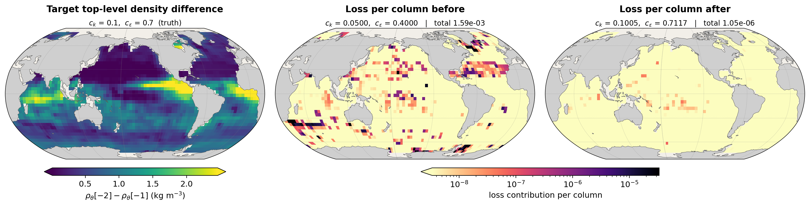

# Report 24: SST Restoring Changes Recovery More Than the Observable Does

[Report-22](report-22-landscape-and-multistart.md) and [report-23](report-23-ts-differences-landscape-and-multistart.md) each calibrated `c_k`/`c_eps` with one observable and one model configuration, and each recovered the true parameters from one of four pre-registered corners. Both ran with `restore_to_climatology=True`, inherited from vercor's own gradient examples without being examined. This report crosses the two choices: two observables by restoring on/off, four landscapes and sixteen descents, all produced by the cleaned-up code in `Results/Report/scripts/paper_calibration/`.

The result is that the model configuration matters more than the observable. Switching the SST restoring off takes recovery from one corner in four to three in four, with either observable.

## What the restoring does

Each coupled step the bulk formulae return the net surface heat flux and its sensitivity to sea surface temperature, `qnec = -dQ/dSST` (`vercor/setups/_external/veros_fluxes.py`). The flag decides whether that second quantity survives (`veros_state.py:prepare_surface_forcing_fields`), and Veros then forms

```
forc_temp_surface = (qnet + qnec * (sst_clim - SST_model)) / (cp_0 * rho_0)
```

With the flag off, `qnec` is zeroed and the atmosphere's flux is imposed as it stands. With it on, the flux carries an extra Haney-type term relaxing SST toward the observed monthly climatology, with a stiffness set by the bulk formulae themselves. For a 50 m layer and `qnec` of order 30 W/m^2/K the relaxation timescale is

```
tau = rho_0 * cp_0 * h / qnec ~ 1025 * 3992 * 50 / 30 ~ 79 days
```

so over a 10-day rollout it damps an SST anomaly by around 12%. The atmosphere-ocean exchange is unaffected either way: `qnet` and the wind stress still come from the atmosphere each step, evaluated at the model's own SST, and the ocean still returns its SST. Salinity is restored unconditionally with a 30-day timescale in the setup itself, independent of this flag.

## Setup

| | |
|---|---|
| model | Veros ocean + JCM land + JAX-GCM atmosphere, coupled through VerCOR, global 4 deg |
| rollout | 10 days, daily coupling, `jax_enable_x64`, CPU |
| observables | `mld_avg` (report-22's) and `tsdiff_avg` (report-23's), both averaged over days 8-10 |
| configurations | those two crossed with `--restore-to-climatology` / `--no-restore-to-climatology` |
| target | synthetic, generated at true `c_k` = 0.1, `c_eps` = 0.7, once per configuration |
| optimizer | `optax.adam`, cosine-decay lr 2e-2 to 0 over 200 iterations, gradient norm clipped at 1.2x the start-point norm |
| starts | report-22's four pre-registered corners, unchanged |

Code: `Results/Report/scripts/paper_calibration/` (`model.py`, `observables.py`, `calibrate.py`, `landscape.py`, `snapshot.py`, `figures/`). Grid jobs 3098254-69 (16 chunks, ~25 min each); descents 3098321-36 (16 runs, ~7.5 h each). Raw data in `figures/report-24/<observable>_<restore|norestore>/`.

**One knob differs from reports 22 and 23**: the clip factor is 1.2 here against 1.2205 there. That number was never physical -- 1.2205 is report-20's hand-picked threshold of 50 divided by its own start-point gradient norm -- and it is held fixed across all four configurations here. Its consequences are measured below.

## The four landscapes



16x16 forward-only scans, `c_k` in [0.02, 0.18] and `c_eps` in [0.25, 1.05], 256 rollouts each.

| configuration | lowest node | dynamic range | local minima | best secondary |
|---|---|---|---|---|
| MLD, restoring on | (0.0947, 0.6767) | 271x | 2 | 5.08x |
| MLD, restoring off | (0.1053, 0.7300) | 270x | 3 | 5.02x |
| T/S, restoring on | (0.0947, 0.6767) | 299x | 6 | 6.76x |
| T/S, restoring off | (0.1053, 0.7300) | 107x | 6 | 3.13x |

**The restoring-on scans reproduce reports 22 and 23 exactly**: 21.190 at (0.0947, 0.6767) for the MLD, 2.3774e-5 at the same node for T/S. The rewritten package gives the same numbers as the scripts that produced those reports, which is the check that the refactor preserved the science.

**The basin sits on truth in all four.** The lowest node moves between (0.0947, 0.6767) and (0.1053, 0.7300) when the restoring is switched off, but those are the two nodes flanking (0.1, 0.7); both lie within half a cell of truth in each direction (spacing 0.0107 and 0.0533), so this is a flip between neighbours and not a displaced minimum.

**Turning the restoring off leaves the MLD landscape alone and flattens the T/S one.** The MLD keeps its dynamic range, its secondary minimum at (0.1053, 0.9433) and that minimum's depth, gaining only one extra shallow dip. The T/S loss loses two thirds of its dynamic range (107x against 299x) and its spurious minima close in, from 6.8-11.4x the lowest node to 3.1-4.1x.

On the landscapes alone, the restoring-off T/S configuration is the least promising of the four. The descents say the opposite.

## Sixteen descents



Four corners per configuration, 200 iterations each. A run counts as recovering truth when both parameters are within 5% at the final iterate.

| configuration | recovered | lowest-loss run | gap to the best failing run |
|---|---|---|---|
| MLD, restoring on | 1 / 4 | start 0, loss 4.26 | 20.2x |
| MLD, restoring off | **3 / 4** | start 0, loss 4.41 | 19.7x |
| T/S, restoring on | 1 / 4 | start 0, loss 1.57e-4 | 1.2x |
| T/S, restoring off | **3 / 4** | start 0, loss 1.05e-6 | 137x |

Final iterates, with each run's lowest-loss iterate in brackets:

| start | MLD, on | MLD, off | T/S, on | T/S, off |
|---|---|---|---|---|
| 0 (0.05, 0.40) | **0.0999 / 0.6988** | **0.0999 / 0.6886** | **0.1025 / 0.7013** | **0.1005 / 0.7117** |
| 1 (0.15, 1.00) | 0.0969 / 0.8160 | 0.1036 / 0.7931 | 0.1020 / 0.8801 | **0.1002 / 0.7044** |
| 2 (0.05, 1.00) | 0.1019 / 0.8814 | **0.1001 / 0.7023** | 0.1034 / 0.8184 | 0.1014 / 0.7506 |
| 3 (0.15, 0.40) | 0.1028 / 0.7704 | **0.1001 / 0.7027** | 0.0987 / 0.5896 | **0.1007 / 0.7148** |

**Switching the restoring off triples the recovery rate, for both observables.** One corner in four becomes three in four. The runs that recover do so cleanly: with T/S and no restoring, three of them fall to ~1e-6 by iteration 150 and stay there.

**The loss still selects the right run in every configuration**, but not equally well. Without restoring, T/S separates its recovering run from its failing one by 137x; with restoring, by 1.2x, which is too close to call on a real problem where truth is unknown. The MLD's gap is ~20x either way.

**The landscape did not predict any of this.** The restoring-off T/S scan has the shallowest basin and the closest spurious minima of the four, and it is the configuration whose descents work best. A 16x16 forward scan measures where the loss is low, not whether a gradient path reaches it; the two came apart here.

## The fitted field, without restoring



Start 0 of the T/S, restoring-off configuration -- the run with the lowest final loss of the sixteen -- rolled out again at truth, at its initial guess and at its converged parameters, over the 2319 columns with a wet level -2. The left panel is the target's top-level potential-density difference `rho[-2] - rho[-1]`, averaged over days 8-10: the quantity report-23 showed the MLD to be a transform of, and which the four T/S channels resolve into their temperature and salinity parts. The other two map each column's contribution to the fitted loss, on a shared log scale.

| | total loss | top 1% of columns |
|---|---|---|
| before (`c_k` = 0.05, `c_eps` = 0.40) | 1.5913e-3 | 72% of the loss |
| after (`c_k` = 0.1005, `c_eps` = 0.7117) | **1.0462e-6** | 50% of the loss |
| reduction | **1521x** | |

The totals are the loss itself, recomputed from the saved fields, and they reproduce the descent's start-point and final losses to every digit.

The picture matches [report-23](report-23-ts-differences-landscape-and-multistart.md)'s equivalent figure with restoring on (1268x, 75% before and 41% after): the same frontal columns dominate before calibration -- the Southern Ocean band at 40-60S, the Gulf Stream and Kuroshio separations, the Agulhas retroflection -- and the same faint equatorial Pacific and Indonesian strip survives after it. So the restoring changes how easily the descent reaches the minimum, not which columns carry the information or where the residual ends up.

## Endpoints are not reproducible at the level of a single run

The restoring-on configurations repeat reports 22 and 23 with one knob changed, the clip factor, 1.2 instead of 1.2205, a 1.7% difference in a threshold that was arbitrary to begin with.

| | report-22/23 (clip 1.2205) | here (clip 1.2) |
|---|---|---|
| MLD, which corner recovers | start 0, 0.0999 / 0.6997 | start 0, 0.0999 / 0.6988 |
| T/S, which corner recovers | start 3, 0.1000 / 0.7039 | start 0, 0.1025 / 0.7013 |
| T/S, start 3's endpoint | 0.1000 / 0.7039 | 0.0987 / 0.5896 |

The MLD repeats. The T/S multistart does not: the corner that recovers changes, and start 3, which converged on truth in report-23, now ends 16% low in `c_eps`. The forward model and the loss are identical -- the grids match to every digit -- so the difference is entirely in the optimizer's path.

This is the sensitivity report-22 flagged as unmeasured under "Single runs", now measured: **an individual endpoint is not a reproducible quantity at this level of detail**, and no conclusion should rest on one descent. What survives the perturbation is the procedure: run the four corners, take the lowest final loss, and read the parameters off that run. That still selects a recovered run in all four configurations, and in both versions of the T/S experiment.

## What this shows and does not show

**It shows** that the SST restoring, a configuration flag inherited from an example script, has a larger effect on whether gradient descent recovers the parameters than the choice between the two observables does: 1/4 against 3/4 in both cases. It also shows that the cleaned-up package reproduces the earlier landscapes exactly, and that the loss-based selection rule survives every variation tried here.

**It does not explain why.** The restoring opposes exactly the SST anomalies that mixing produces, so it plausibly flattens the descent direction along `c_eps` while leaving the sampled loss surface looking sharp; but nothing here tests that, and the landscapes point the other way. A forward-mode sensitivity comparison of the two configurations, in the manner of [report-17](report-17-forward-sensitivity-identifiability.md), would settle it for about 15 minutes of compute.

**Whether restoring-off is the right configuration is a separate question.** It recovers better, but it is also the less physically constrained setup: nothing holds the coupled SST near observations, and over runs longer than 10 days the model would be free to drift. This experiment says which configuration is easier to calibrate in, not which one should be used.

**Single runs again.** Sixteen deterministic descents, one per cell of the design. Given what the clip-factor change did, the recovery counts should be read as "3 of 4 rather than 1 of 4", not as a statement about which specific corners work.

## Related results

- [report-22](report-22-landscape-and-multistart.md) and [report-23](report-23-ts-differences-landscape-and-multistart.md): the two single-configuration experiments this one crosses.
- [report-20a](report-20a-coupled-calibration-demo.md): the source of the gradient clip, hand-picked at 50 after a 200x gradient spike.
- [report-17](report-17-forward-sensitivity-identifiability.md): the forward-mode machinery that could test the mechanism proposed above.

The obvious follow-ups are a clip-factor sensitivity test, now known to change outcomes; and forward-mode sensitivity maps with and without restoring, to find where along the parameter directions the restoring removes signal.
