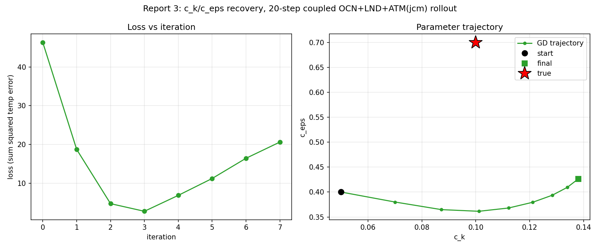
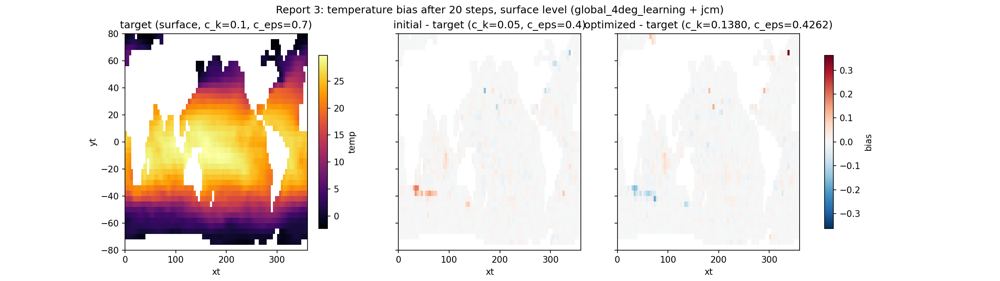

# c_k/c_eps: How Far Can the Rollout Go? (Gradient Bracketing + n=20 Fit)

Follow-up to Reports 1-2, prompted by the question "can we push to 1000
steps?". Short answer: no, not usefully -- but the practical ceiling is
much higher than a first (badly-calibrated) check suggested. This report
covers the bracketing investigation (`debug_script/13-15`) and a full fit
at the largest rollout length found to still have trustworthy gradients
(`N_STEPS=20`, 2x Report 2's 10 steps).

## Why not 1000 steps directly

Two risks, both flagged before running anything:

1. **Memory**: vercor's coupler checkpoints each step inside a single
   `lax.scan` (`jax.lax.scan(jax.checkpoint(run_step), ...)`,
   `vercor/_runtime/backends.py`) -- the Veros-Autodiff long-rollout report
   (`Veros-Autodiff/Results/Report/report-longrollouts-1.md`) found this
   exact pattern (single-level checkpoint, no outer chunking) crashes from
   linear memory growth around n=400 on a 16GB GPU. Untested at n=1000 on
   our CPU setup, but the risk is real without adding the "double
   checkpoint" (chunked scan-of-checkpointed-scans) pattern that report
   found necessary past n≈2000, which would require changes to vercor's
   own coupler internals -- out of scope here.
2. **Gradient correctness through chaos**: that same report found gradient
   magnitudes become numerically meaningless well before the memory wall,
   for *ocean-only* differentiation (trustworthy to ~n=1000, garbage by
   n=5000). Our model additionally couples in a chaotic weather model
   (JCM atmosphere), which has a much shorter predictability horizon than
   ocean dynamics -- so this breakdown was expected to arrive far sooner
   here.

## Escalating gradient-vs-FD sweep (`debug_script/13`)

Single `value_and_grad(c_k)` call (not a full fit -- cheap sanity check)
at N_STEPS in [25, 50, 100, 250, 500, 1000], each compared to one central
finite difference at `eps=1e-3`. Stopped after the first length with >50%
relative FD disagreement.

| N_STEPS | AD grad | FD grad (eps=1e-3) | rel err |
|---|---|---|---|
| 25 | -4.57e+03 | -6.62e+04 | 93.1% |

Stopped here -- looked like an early, hard breakdown. **This one-eps check
was misleading.**

## FD eps sweep at n=25 (`debug_script/14`)

Following the same lesson Veros-Autodiff's own reports flag (a single
blind `eps` choice can be unreliable -- see their `report-2/section3b`
notes), swept `eps` at fixed N_STEPS=25:

| eps | FD grad | rel err vs AD |
|---|---|---|
| 1e-2 | -1.01e+03 | 350% |
| 3e-3 | -1.75e+04 | 74% |
| 1e-3 | -6.62e+04 | 93% |
| 3e-4 | **+8.07e+03** | 157% (sign flip) |
| 1e-4 | +1.55e+05 | 103% |

The FD estimate itself doesn't converge as `eps` shrinks -- it doesn't even
hold a consistent sign. This is the signature of **chaotic trajectory
divergence**, not floating-point roundoff (the value's magnitude, ~7.5e6,
is far too large for float64 precision to explain swings this size at
these eps scales) or a bad eps pick alone: by n=25, perturbing `c_k` by as
little as 1e-4 sends the coupled trajectory onto a different, chaotically
diverged realization by the end of the rollout. The AD gradient is a
well-defined tangent-linear sensitivity regardless, but FD (a discrete
secant across two now-decorrelated trajectories) simply can't validate it
here. Neither method is "wrong" -- they're answering different questions
once chaos has decorrelated the perturbed trajectories.

## Bracketing the actual onset (`debug_script/15`)

Tested N_STEPS in [12, 15, 20] with two eps values each (1e-2, 1e-3), to
see how early this really starts and whether a properly-scaled eps still
tracks AD:

| N_STEPS | AD grad | FD (eps=1e-2) | rel err | FD (eps=1e-3) |
|---|---|---|---|---|
| 12 | -5.70e+03 | -7.85e+03 | 27% | +5.8e+01 (noise) |
| 15 | -5.07e+03 | -4.71e+03 | **7.6%** | -3.01e+04 (noise) |
| 20 | -4.75e+03 | -5.10e+03 | **7.3%** | -5.97e+04 (noise) |

Two findings that revise the pessimistic read from n=25:

- **The AD gradient itself is remarkably stable** across n=12/15/20/25 --
  all cluster in the -4600 to -5700 range. It isn't exploding; the earlier
  "breakdown" was in the FD *comparison*, not the AD gradient.
- **A correctly-scaled FD eps (1e-2, not 1e-3) confirms AD well through
  n=20** (7-8% relative error -- as good as Report 1/2's shorter-rollout
  checks). eps=1e-3 is unusable at every length tested here, including
  n=12 -- the chaotic amplification threshold is below that scale even at
  short rollouts, it just doesn't yet corrupt the *larger*-eps estimate
  until somewhere between n=20 and n=25.

**Practical conclusion**: gradients through this coupled model are
trustworthy at least to n=20, with an important methodological footnote --
FD validation needs a properly scaled eps (this codebase's convention of
picking eps per loss-scale, not a single fixed default, matters more here
than in the ocean-only case). The transition to unreliable is somewhere in
[20, 25], not near n=1000; a finer bracket in that window wasn't run here to
keep this pass's cost bounded, but that's the natural follow-up.

## Fit at N_STEPS=20 (2x Report 2)

Same setup as Reports 1-2 (true `c_k=0.1, c_eps=0.7`, wrong start
`c_k=0.05, c_eps=0.4`, `optax.adam(lr=2e-2)`), `N_ITERS=8`.

| iter | loss | c_k | c_eps |
|---|---|---|---|
| init | -- | 0.0500 | 0.4000 |
| 0 | 4.630e+01 | 0.0700 | 0.3800 |
| 1 | 1.874e+01 | 0.0872 | 0.3648 |
| 2 | 4.779e+00 | 0.1011 | 0.3614 |
| 3 | 2.812e+00 | 0.1122 | 0.3680 |
| 4 | 6.913e+00 | 0.1211 | 0.3795 |
| 5 | 1.126e+01 | 0.1284 | 0.3936 |
| 6 | 1.647e+01 | 0.1339 | 0.4093 |
| 7 | 2.064e+01 | 0.1380 | 0.4262 |

**`c_k` passes essentially through the true value** (0.1011 at iteration 2,
1.1% off) before the familiar overshoot as `c_eps` keeps pulling the
optimizer onward -- same qualitative pattern as Reports 1-2, and again not
a sign of a broken gradient: it's the same fixed-`lr` Adam
overshoot-then-recover behavior, just not given enough iterations here (8,
vs. Report 1's 15) to recover a second time.

The bias snapshot shows a slightly larger-magnitude, more structured signal
than Reports 1-2 (colorbar now ±0.3 vs. ±0.2) -- consistent with 20 days
giving TKE-driven mixing differences more time to imprint on the surface
field, without yet being large enough to look qualitatively different from
the shorter-rollout cases.

## Bottom line

- **The coupled OCN+LND+ATM(jcm) model differentiates correctly and
  usably through at least n=20** -- confirmed both by direct FD validation
  (properly-scaled eps) and by a clean, working fit that recovers `c_k` to
  ~1% at its best point.
- **n=1000 (or even n=50-100) is very likely unusable** for this exact
  gradient-based calibration approach, per the chaos evidence above --
  not a bug to fix, an intrinsic property of gradients through a chaotic
  coupled ocean+weather model. Getting useful signal from much longer
  rollouts would need a fundamentally different approach (e.g. ensemble/
  covariance-based calibration, or ensemble-averaged ("shadowing")
  gradients used in some chaotic-system differentiation literature), not
  just more compute -- out of scope for this investigation.
- **The practical sweet spot for this calibration setup is short rollouts
  (≤20 days)**, run for enough Adam iterations (15+, per Report 1) to let
  the overshoot recover, ideally with per-parameter learning rates so
  `c_k` doesn't overshoot while waiting for `c_eps`'s slower gradient.
