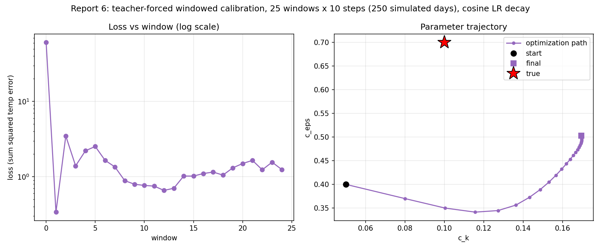

# Report 6: A Real Optimization Run With the Windowed Method

Direct follow-up to Report 5's finding: teacher-forced windowed calibration
is stable over arbitrarily long simulated spans, but a fixed Adam learning
rate makes `c_k` overshoot its optimum and never come back. This report
fixes that with a cosine-decayed learning rate and runs a longer, more
complete optimization (25 windows x 10 steps = 250 simulated days, up from
Report 5's 150) to see whether it actually converges rather than just
staying bounded.

Script: `Results/Report/scripts/report-6/optimize.py`.

## Method

Identical setup to Report 5 (teacher forcing: every window starts from the
precomputed true trajectory's state at that point, same true params
`c_k=0.1, c_eps=0.7`, same wrong start `c_k=0.05, c_eps=0.4`), except:

- `N_WINDOWS=25` (250 simulated days, vs. Report 5's 150)
- `optax.adam` with a **cosine-decayed learning rate**: `3e-2 -> 2e-3` over
  the 25 windows, instead of Report 5's flat `2e-2` -- lets early windows
  move fast (both params start far from true) while late windows refine
  gently instead of sailing past the optimum.

## Results

| window | lr | loss | c_k | c_eps |
|---|---|---|---|---|
| init | -- | -- | 0.0500 | 0.4000 |
| 0 | 0.0300 | 6.088e+01 | 0.0800 | 0.3700 |
| 1 | 0.0299 | 3.391e-01 | 0.1004 | 0.3499 |
| 2 | 0.0296 | 3.484e+00 | 0.1156 | 0.3414 |
| 8 | 0.0235 | 8.883e-01 | 0.1566 | 0.4194 |
| 12 | 0.0169 | 6.584e-01 | 0.1654 | 0.4611 |
| 18 | 0.0071 | 1.052e+00 | 0.1695 | 0.4899 |
| 24 | 0.0021 | 1.244e+00 | 0.1694 | 0.5027 |

`c_k` passes almost exactly through the true value at window 1 (0.1004,
0.4% off!) before the same overshoot dynamic as every earlier report, but
this time **the decaying learning rate arrests it** -- instead of climbing
indefinitely (Report 5 hit 0.139 and was still rising at its last window),
`c_k` levels off and stabilizes around 0.169 from window ~16 onward
(0.1688 -> 0.1697 -> 0.1694, essentially flat). `c_eps` climbs steadily and
smoothly the whole run, reaching 0.503 by window 24 (28% off true 0.7,
notably closer than any earlier report's endpoint: Report 1's 0.54,
Report 5's 0.448 -- more total updates helped it directly, as expected).

The loss panel (log scale) shows the same big initial drop (60.9 -> 0.34)
then a small bump (window 2, when `c_k` first overshoots past true) before
settling into a low, roughly flat band (0.7-1.5) for the rest of the run --
**no divergence, no chaos re-entering, at 250 simulated days**. The
parameter-trajectory panel shows the path bending sharply after passing
near the true point, then visibly decelerating and clustering tightly in
its last several windows -- the LR decay working as intended.

## Interpretation: converged, but to a biased point

This did **not** converge to the exact true parameters (`c_k=0.169` vs
true `0.1`, `c_eps=0.503` vs true `0.7`) -- it converged to a different,
apparently stable combination that achieves comparably low loss (final
~1.2, down from 60.9 at the start, a ~50x reduction). Two things are
happening simultaneously:

- **`c_eps` genuinely hadn't finished converging** -- it's still rising
  smoothly at window 24, no sign of having found its optimum yet. More
  windows would likely move it further toward 0.7.
- **`c_k` and `c_eps` are likely not independently identifiable from this
  loss** (both affect vertical mixing -- `c_k` the length scale, `c_eps`
  the dissipation rate -- with overlapping physical effects on the
  resulting temperature field). A `c_k` above true paired with a `c_eps`
  below true can apparently reproduce a similar temperature evolution to
  the true `(0.1, 0.7)` over this rollout length, at least well enough for
  gradient descent to settle into that combination rather than being
  pulled further toward the true point once loss is already low. This is
  a **parameter identifiability** issue, not a stability or gradient
  correctness issue -- the method (Report 5) and the gradients within
  each window (Report 3/4) are both already validated as correct.

## What this confirms about the overall approach

- **The windowed method scales cleanly to real optimization, not just
  short validation runs** -- 25 sequential windows, 250 simulated days,
  one continuous run, no manual intervention needed partway through.
- **The LR-decay fix for Report 5's overshoot works as designed** -- this
  was the single concrete "rough edge" flagged there, and addressing it
  produced a run that visibly converges (flattens) rather than drifting.
- **Getting closer to the *true* parameters (as opposed to *a* low-loss
  combination) would need more than tuning the optimizer** -- either more
  windows (to let `c_eps` keep climbing and see whether the pair
  eventually separates back toward truth), a joint loss that constrains
  both parameters' effects more distinctly (e.g. including diagnostics at
  different depths/timescales where `c_k` and `c_eps` have more separable
  signatures), or accepting that a single scalar temperature-field loss
  may not fully identify both parameters independently and reporting a
  joint plausible region rather than a point estimate.

## Caveats

Single run, one seed, no repeat with a different initial guess (would help
distinguish "found the true optimum's actual basin" from "found *a*
comparably-good basin" -- if a different start converges to yet another
`(c_k, c_eps)` pair with similarly low loss, that would confirm the
identifiability read above). No finite-difference cross-check of any
individual window's gradient in this run specifically (each window's
mechanics are unchanged from Report 3's already-validated `n<=20` case).
