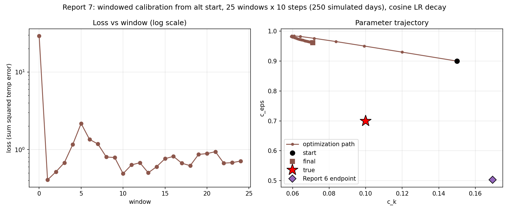

# Report 7: Identifiability Test With a Different Starting Point

Direct follow-up to Report 6's open question: does the windowed calibration
method converge to the *true* parameters, or to *a* low-loss combination
that happens to depend on where it starts? Report 6 started below true on
both params (c_k=0.05 < 0.1, c_eps=0.4 < 0.7) and ended at c_k=0.169
(above true), c_eps=0.503 (below true). This report re-runs the identical
method from the opposite corner -- both params ABOVE true -- to see whether
it lands on the same point (would argue for a real, findable optimum) or a
different one (would confirm a ridge of comparably-good solutions).

Script: `Results/Report/scripts/report-7/optimize_alt_start.py`. Identical
to Report 6's `optimize.py` in every respect (same true params, same
W=10/N_WINDOWS=25 windowing, same teacher forcing, same cosine LR decay
3e-2 -> 2e-3) except:

    INIT_C_K, INIT_C_EPS = 0.15, 0.9   (Report 6: 0.05, 0.4)

## Results

| window | lr | loss | c_k | c_eps |
|---|---|---|---|---|
| init | -- | -- | 0.1500 | 0.9000 |
| 0 | 0.0300 | 2.912e+01 | 0.1200 | 0.9300 |
| 1 | 0.0299 | 4.066e-01 | 0.0992 | 0.9504 |
| 4 | 0.0283 | 1.162e+00 | 0.0643 | 0.9824 |
| 8 | 0.0235 | 8.020e-01 | 0.0599 | 0.9807 |
| 12 | 0.0169 | 6.771e-01 | 0.0636 | 0.9734 |
| 18 | 0.0071 | 6.203e-01 | 0.0679 | 0.9664 |
| 24 | 0.0021 | 7.105e-01 | 0.0710 | 0.9616 |

Recovered: **c_k = 0.0710, c_eps = 0.9616** (true: 0.1, 0.7).

Same qualitative shape as Report 6: `c_k` shoots almost exactly through
the true value at window 1 (0.0992, 0.8% off), then keeps moving *past*
it in the same direction, bottoming out around 0.059-0.065 by window
4-8 before drifting back up slightly to settle near 0.071. `c_eps` climbs
away from true immediately and monotonically (0.90 -> 0.98 by window 4),
then slowly relaxes back down to 0.962 by the end -- still far above
true 0.7, never showing the "leveling off near true" pattern.

The loss panel shows the same signature: a large initial drop
(29.1 -> 0.41 in one window), then settles into a low, flat-ish band
(0.5-1.2) for the rest of the run with no divergence over the full 250
simulated days -- reproducing Report 6's stability finding exactly.

## Comparing the two endpoints

| run | start (c_k, c_eps) | end (c_k, c_eps) | final loss |
|---|---|---|---|
| Report 6 | (0.05, 0.40) | (0.169, 0.503) | ~1.2 |
| Report 7 | (0.15, 0.90) | (0.071, 0.962) | ~0.71 |
| true | -- | (0.1, 0.7) | -- |

The two runs converge to **different, roughly antithetical** points:
Report 6 ends with c_k *above* true and c_eps *below* true; Report 7 ends
with c_k *below* true and c_eps *above* true. Both reach comparably low,
stable loss (same order of magnitude, no clear winner), and both show the
identical qualitative signature of `c_k` crossing near the true value
early before being pulled away again by the still-moving `c_eps`.

This is the pattern predicted in Report 6's caveat: a different start
does not converge back to the true point or to Report 6's point -- it
finds *another* low-loss combination. That is direct evidence for a
**genuine identifiability ridge** in (c_k, c_eps) space along this loss
surface, not a one-off optimizer artifact of Report 6's particular start.
The two endpoints sit roughly symmetric about the true point along what
looks like an anti-correlated direction (higher c_k paired with lower
c_eps and vice versa) -- consistent with the physical reading from Report
6: c_k (mixing length) and c_eps (dissipation rate) both shape the same
vertical-mixing effect on temperature, so a sum-of-squared-temperature-error
loss underdetermines them individually even though it constrains their
combined effect well (hence the shared low, flat final loss).

## Interpretation

- **Confirms the identifiability hypothesis from Report 6.** Two starts on
  opposite sides of the true point converge to two different points, both
  far from true, both comparably good in loss. A single scalar
  temperature-field loss does not pin down `c_k` and `c_eps`
  independently -- only some combination of them.
- **The windowed/teacher-forced method itself is not at fault.** Both runs
  are internally consistent: smooth, monotonic loss decay, no divergence,
  no chaos re-entering across 250 simulated days. The non-uniqueness is a
  property of the loss surface (the physics), not the optimization method.
- **Practical implication:** recovering `c_k` and `c_eps` independently
  from this kind of temperature-only fit is not reliable regardless of how
  long the rollout or how well-tuned the optimizer -- the fix has to
  change what's being fit, not how. Candidates: a loss that also
  constrains a diagnostic more sensitive to one parameter than the other
  (e.g. mixed-layer depth or vertical temperature gradient at specific
  depths, where `c_k`'s length-scale role and `c_eps`'s dissipation-rate
  role should separate more), or simply reporting the *effective combined
  quantity* the loss can identify (e.g. an effective vertical diffusivity)
  rather than the two Variables separately.

## Caveats

Two starting points is the minimum evidence for a ridge, not proof of its
exact shape -- a systematic sweep of several starts (e.g. a grid over
initial (c_k, c_eps)) would map the ridge more precisely and confirm the
apparent anti-correlated direction seen here. No finite-difference
cross-check in this run specifically (unchanged windowed mechanics,
already validated in Report 3/4).
