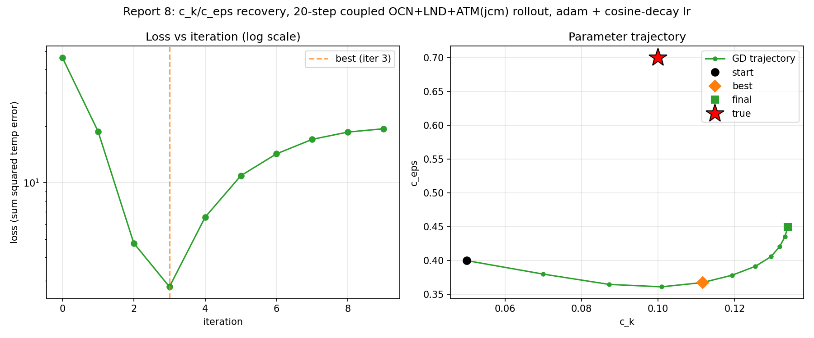
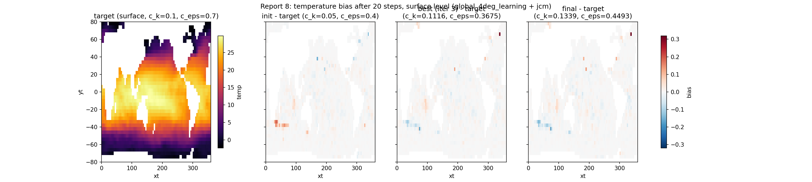
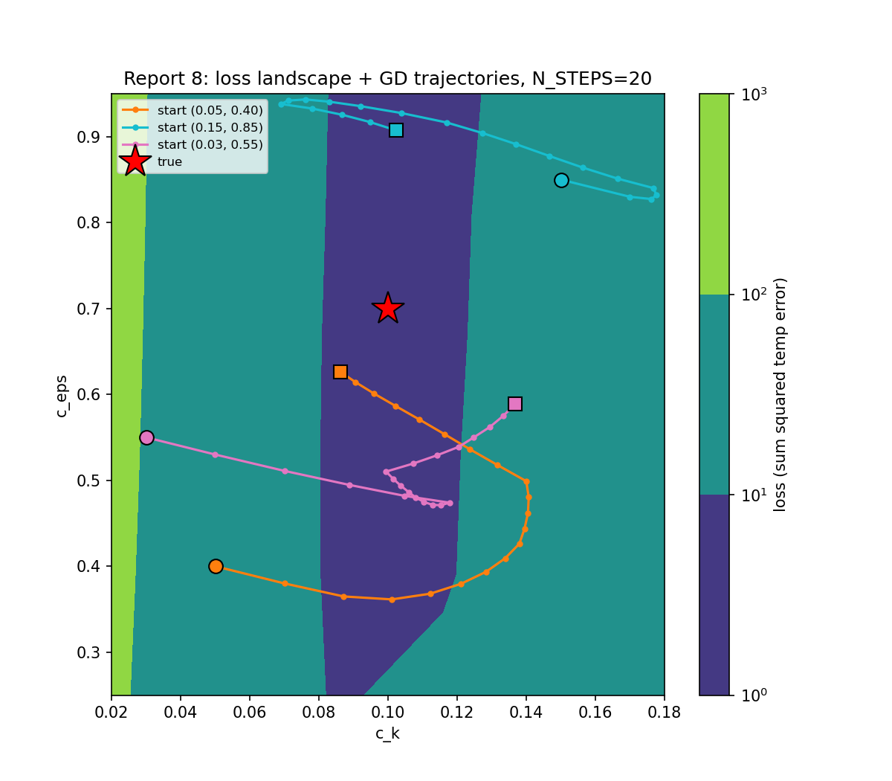

# Report 8: Classical Gradient Calibration at N_STEPS=20

Direct-gradient fit of Veros TKE parameters `c_k`, `c_eps` through the fully coupled OCN(Veros)+LND+ATM(jcm) model. Single `jax.value_and_grad` over the full rollout, fixed `optax.adam` learning rate, no windowing.

Script: `Results/Report/scripts/report-8/fit_and_generate_figures.py`.

## Setup

- N_STEPS = 20, N_ITERS = 20, lr = 2e-2
- True: c_k=0.1, c_eps=0.7
- Init: c_k=0.05, c_eps=0.4
- Loss: `sum((temp - target_temp)^2)`over OCN's full 3D temperature field

## Results

| iter | loss | c_k | c_eps |
|---|---|---|---|
| init | -- | 0.0500 | 0.4000 |
| 0 | 4.630e+01 | 0.0700 | 0.3800 |
| 2 | 4.779e+00 | 0.1011 | 0.3614 |
| 10 | 2.482e+01 | 0.1407 | 0.4804 |
| 12 | 2.378e+01 | 0.1317 | 0.5177 |
| 15 | 7.348e+00 | 0.1091 | 0.5707 |
| 17 | 8.773e-01 | 0.0959 | 0.6011 |
| 19 | 2.747e+00 | 0.0863 | 0.6261 |

Best point: iteration 17, loss=0.877, c_k=0.0959 (4.1% error), c_eps=0.6011 (14.1% error). Final iteration 19: loss=2.747, c_k=0.0863, c_eps=0.6261.

## Notes

Loss overshoots to 24.8 (iteration 10) before recovering to 0.877 (iteration 17), then rises again to 2.75 by iteration 19. `c_k` peaks near 0.14 around iteration 10-11, then descends back through the true value. `c_eps` rises monotonically throughout. Final iteration is not the best iteration.

## Loss landscape and multiple starts

Grid scan (forward-only, no grad): 6x6 over c_k in [0.02, 0.18], c_eps in [0.25, 0.95], same N_STEPS=20 target. Two additional optimizations run with the same recipe (lr=2e-2, 20 iterations) from different starting points, overlaid with the run above.

Script: `Results/Report/scripts/report-8/landscape_multistart.py`.

| start (c_k, c_eps) | best iter | best loss | c_k at best | c_eps at best | end (c_k, c_eps) | end loss |
|---|---|---|---|---|---|---|
| (0.05, 0.40) | 17 | 0.877 | 0.0959 | 0.6011 | (0.0863, 0.6261) | 2.747 |
| (0.15, 0.85) | 11 | 2.579 | 0.0920 | 0.9356 | (0.1023, 0.9074) | 3.023 |
| (0.03, 0.55) | 12 | 1.008 | 0.0994 | 0.5101 | (0.1368, 0.5888) | 16.910 |

The grid shows a narrow low-loss band (loss < 10) running roughly vertically near c_k in [0.08, 0.12], wide in c_eps (spans the full [0.3, 0.95] range at similar loss). All three trajectories converge in c_k onto this band but continue moving in c_eps within it rather than stopping.
