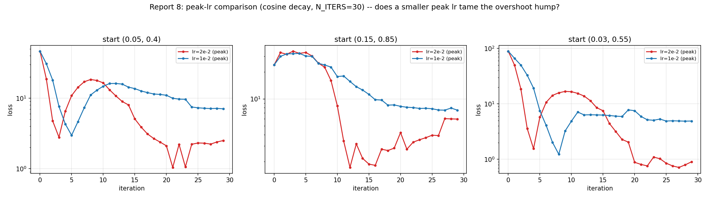
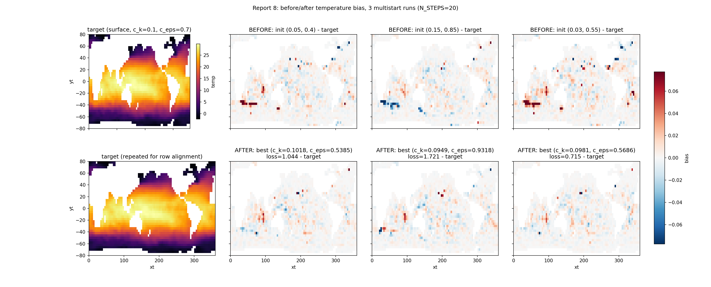

# Report 8: Classical Gradient Calibration at N_STEPS=20

Direct-gradient fit of Veros TKE parameters `c_k`, `c_eps` through the fully coupled OCN(Veros)+LND+ATM(jcm) model. Single `jax.value_and_grad` over the full rollout, fixed `optax.adam` learning rate, no windowing.

Script: `Results/Report/scripts/report-8/fit_and_generate_figures.py`.

## Setup

- N_STEPS = 20, N_ITERS = 20, lr = 2e-2
- True: c_k=0.1, c_eps=0.7
- Init: c_k=0.05, c_eps=0.4
- Loss: `sum((temp - target_temp)^2)`over OCN's full 3D temperature field

## Results

| iter | loss | c_k | c_eps |
|---|---|---|---|
| init | -- | 0.0500 | 0.4000 |
| 0 | 4.630e+01 | 0.0700 | 0.3800 |
| 2 | 4.779e+00 | 0.1011 | 0.3614 |
| 10 | 2.482e+01 | 0.1407 | 0.4804 |
| 12 | 2.378e+01 | 0.1317 | 0.5177 |
| 15 | 7.348e+00 | 0.1091 | 0.5707 |
| 17 | 8.773e-01 | 0.0959 | 0.6011 |
| 19 | 2.747e+00 | 0.0863 | 0.6261 |

Best point: iteration 17, loss=0.877, c_k=0.0959 (4.1% error), c_eps=0.6011 (14.1% error). Final iteration 19: loss=2.747, c_k=0.0863, c_eps=0.6261.

## Notes

Loss overshoots to 24.8 (iteration 10) before recovering to 0.877 (iteration 17), then rises again to 2.75 by iteration 19. `c_k` peaks near 0.14 around iteration 10-11, then descends back through the true value. `c_eps` rises monotonically throughout. Final iteration is not the best iteration.

## Loss landscape and multiple starts

v2: grid scan (forward-only, no grad) refined 6x6 -> 12x12 over c_k in [0.02, 0.18], c_eps in [0.25, 0.95], same N_STEPS=20 target. All three starting points (including the original (0.05, 0.40) one from the run above, which v1 just reused with its old fixed-lr trajectory) are now re-optimized from scratch with the same cosine-decay-lr recipe used in the report-8 v2 run: `optax.adam` + `optax.cosine_decay_schedule` (peak lr=2e-2, decay to 0 over N_ITERS=30).

Script: `Results/Report/scripts/report-8/landscape_multistart.py`.

| start (c_k, c_eps) | best iter | best loss | c_k at best | c_eps at best | end (c_k, c_eps) | end loss |
|---|---|---|---|---|---|---|
| (0.05, 0.40) | 21 | 1.044 | 0.1018 | 0.5385 | (0.1057, 0.5440) | 2.508 |
| (0.15, 0.85) | 12 | 1.721 | 0.0949 | 0.9318 | (0.1159, 0.9282) | 5.963 |
| (0.03, 0.55) | 27 | 0.715 | 0.0981 | 0.5686 | (0.0983, 0.5687) | 0.904 |

The finer grid sharpens the same picture as v1: a narrow low-loss band running roughly vertically near c_k in [0.08, 0.12] (loss drops below 10 starting around c_k=0.078, bottoms out under 2 around c_k=0.09-0.11, rises back above 10 past c_k=0.12), wide and shallow in c_eps. All three trajectories converge in c_k onto this band and settle there, with c_eps continuing to drift within it rather than locking onto the true value (0.7) -- the (0.03, 0.55) start lands closest to true c_eps and gets the lowest loss of the three (best loss 0.715, vs 1.044 and 1.721 for the other two starts), but its c_eps still stalls at 0.57, well short of 0.7.

The cosine schedule does not remove the overshoot-then-recover hump seen in the original fixed-lr run -- all three starts show it: an initial fast drop, then a hump back up within the first third of the run (peak at iteration 3-9, 17-24x the eventual best loss), then a second descent to the run's best point, then a late-run plateau where loss fluctuates within roughly 2-3x of the best rather than continuing to improve. In 2 of 3 starts the best iteration is not the last one (iter 21/30 and iter 12/30 respectively), same failure mode "best != final" noted in the single-run recipe above; only the (0.03, 0.55) start's final iteration (0.904) stays close to its best (0.715). The shrinking step size does flatten the *late*-run fluctuation compared to what a fixed lr would give, but by the time the schedule has decayed enough to matter the hump has already happened.

### Does a smaller peak lr tame the overshoot hump? (negative result)

Tried halving the cosine schedule's peak lr (2e-2 -> 1e-2), same `N_ITERS=30`, same 3 starts, to see if a gentler step size avoids the overshoot-then-recover hump instead of just recovering from it. Script: `Results/Report/scripts/report-8/landscape_multistart_lowlr.py`.

It doesn't help -- it's worse. All three starts: the smaller hump at lr=1e-2 is real (peaks lower and later than lr=2e-2's), but the run then stalls at a loss floor (5-8) it never escapes, ending 2-7x worse than lr=2e-2's best in every case (start (0.05,0.4): best 2.977 vs 1.044; start (0.15,0.85): best 7.497 vs 1.721; start (0.03,0.55): best 1.233 vs 0.715). The cosine schedule decays to ~0 by iteration 30 regardless of peak value, so lr=1e-2 runs out of usable step size before it can complete the second descent that lr=2e-2 manages within the same budget. Halving the peak lr without also extending `N_ITERS` isn't a free improvement -- it needs proportionally more iterations to have a fair shot, which is the same "more compute" cost as any other convergence fix here (e.g. a longer rollout to better constrain `c_eps`, per the identifiability issue noted above), not something a schedule tweak sidesteps.

### Does disabling per-step logging speed up the rollout? (negative result)

The coupled rollout already runs through one top-level `jax.jit(jax.lax.scan(...))` per uniform-schedule chunk (`vercor/_runtime/backends.py:build_jax_chunk_executor`) -- contrary to what the single-run recipe's docstring above claims ("no top-level jax.jit of the whole coupled rollout exists in this codebase"), that's out of date for the current vercor version. But every scanned step fires an *ordered* `jax.debug.callback` for progress logging (`vercor/_runtime/progress.py`, plus each component's own `logger.info(...)` calls, e.g. the ATM component's per-step "Mean of SST" line) -- and `ordered=True` host callbacks are a textbook way to force host/device sync every iteration, which would matter a lot for GPU throughput. `Coupler(..., log_level=...)` defaults to `"INFO"`, which is what every report-8 script has used; `JaxCallbackLogger._log` (`vercor/_logging/callback.py`) only skips registering the callback when the level is disabled, so `log_level="WARNING"` should silence all of it for free.

Tested directly: timed `jax.value_and_grad` over the same N_STEPS=20 rollout, log_level="INFO" (default) vs "WARNING", 1 compile call + 3 steady-state repeats each. Script: `Results/Report/scripts/report-8/log_level_timing.py`.

| log_level | first call (compile) | mean of 3 repeats |
|---|---|---|
| INFO | 200.3s | 195.7s (195.8, 195.9, 195.3) |
| WARNING | 197.0s | 196.6s (197.2, 197.0, 195.7) |

Speedup: 1.00x -- no difference at all. The per-step logging callbacks are not the bottleneck; the ~195-200s/call is dominated by something else (likely the actual scanned physics computation itself, possibly worsened by `jax.checkpoint` re-running the forward pass during the backward pass -- that's a real cost, not free logging overhead). Finding the *actual* bottleneck would need profiling (`jax.profiler`) rather than more guess-and-check remote runs; not attempted here.

### Temperature bias comparison: before vs. after optimization

Each start's params rolled forward through the same coupled model (forward-only, N_STEPS=20) both *before* optimization (the raw start point, e.g. (0.05, 0.40)) and *after* (that run's best-iteration `(c_k, c_eps)`), both compared against the same target field. Same recipe as the single-run temperature-bias snapshot above, generalized to a before/after grid across all 3 multistart runs.

Script: `Results/Report/scripts/report-8/landscape_bias_comparison.py`.

RMS bias over the surface field drops for all three runs after optimization: 0.0139 -> 0.0085 (start (0.05, 0.40)), 0.0128 -> 0.0093 (start (0.15, 0.85)), 0.0247 -> 0.0133 (start (0.03, 0.55)) -- roughly a 1.6-1.9x reduction in each case, visible in the figure as the bottom ("AFTER") row reading much flatter/whiter than the top ("BEFORE") row. The one exception in the raw max: start (0.03, 0.55)'s AFTER panel has a higher peak |bias| (0.52 vs. 0.39 before) than its BEFORE panel, but that's a single noisy grid cell (visible as the one dark-blue pixel) rather than a real regression -- its RMS still improves the most of the three. All post-optimization biases stay small relative to the field itself (temperatures span 0-28).
