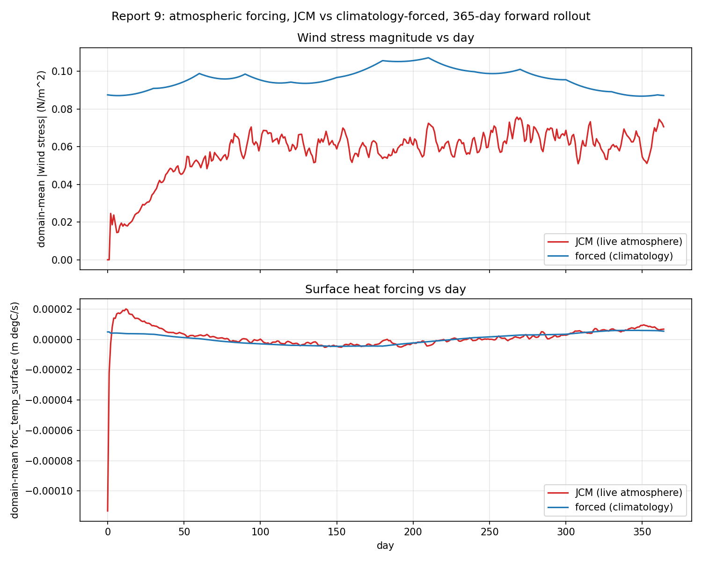

# Report 9: Atmospheric Forcing, JCM vs Climatology-Forced (Forward-Only)

Direct visual comparison of the forcing OCN actually receives under the two configs used in debug_script/20 and the coupled reports: live JCM coupling (`uses_atmosphere_forcing=True`) vs prescribed climatological forcing (`uses_atmosphere_forcing=False, restore_to_climatology=True`). Forward-only, no gradients, daily resolution, 365 days (extended from an initial 90-day pass to see a full climatological cycle and whether JCM settles).

Script: `Results/Report/scripts/report-9/forcing_comparison.py`.

## Method

Both configs run day by day (Coupler rebuilt per day, same pattern as the report-6/7/8 windowed scripts, state carried forward across days). Two fields extracted from the OCN payload each day: `surface_taux`/`surface_tauy` (wind stress, combined into magnitude) and `forc_temp_surface` (net surface heat forcing) -- the same Veros state variable names in both configs (`vercor/setups/_external/veros_setup.py` sets them from JCM's bulk-flux output in the coupled case, from monthly climatology interpolation in the forced case).

## Results: domain-mean curves

Wind stress magnitude: forced traces a clean annual cycle -- 0.087 N/m^2 at day 0, rising to a peak ~0.107 around day 210-270, back down to 0.087 by day 364 (the climatology closing its loop, as expected). JCM starts near 0 (first-step spin-up), climbs over ~day 0-90 to a noisy band, then stays in that band (roughly 0.05-0.075 N/m^2) for the rest of the year -- no matching seasonal hump, persistent day-to-day jaggedness throughout, statistically flat on average once past the initial transient.

Surface heat forcing: forced shows a shallow seasonal dip (slightly negative around day 150, back to positive by day 350). JCM has a large initial transient (down to -1.1e-4 at day 0, up to +2.0e-5 by day 12), decays over ~day 0-150, and from roughly day 150 onward tracks visibly close to the forced curve's smooth seasonal shape, with noise superimposed on top of it.

So at the domain-mean level: JCM's initial spin-up transient (~100-150 days) settles into a statistically stationary regime -- roughly constant mean and variability for the rest of the year, and for heat forcing specifically, converging toward the same seasonal envelope the climatology traces. It does not develop a matching seasonal cycle in wind stress magnitude the way the forced case does by construction.

## Results: spatial pattern (GIF)

Frames at day 180 and day 364 side by side (GIF stride 2 days, 183 frames):

Forced (right panel in each image): same broad structure at both days -- a bright, spatially coherent Southern Ocean band (~-45 to -60 lat), a North Atlantic patch near 40-60N. Shape essentially unchanged year to year (as expected of a repeating climatology), magnitude shifts with season.

JCM (left panel in each image): scattered bright patches at both days, in different locations each time -- day 180 has bright spots near (70,-45), (90,-55), (320,55); day 364 has bright spots near (200,35), (220,40), (280,-55), (340,-60), none matching day 180's locations, and none matching the earlier 90-day pass's day-30/day-89 locations either. This persists for the full year: the small-scale spatial pattern never "stabilizes" or repeats -- only the domain-mean statistics do.

## Interpretation

Two different things "stabilize" and they shouldn't be conflated: JCM's domain-mean forcing statistics (its mean level and spread) settle into a stationary regime after an initial ~100-150 day transient, and for heat forcing specifically converge toward tracking the same seasonal envelope the climatology has by construction. But the instantaneous spatial pattern never stabilizes -- it keeps producing new, differently-located storm/eddy-scale features throughout the entire year, with no repeating structure. Climatological forcing is the opposite on both counts: fixed spatial structure, and a smooth, repeating (not stationary-noisy but literally periodic) seasonal cycle by construction. Domain-mean scalars alone would suggest the two forcings converge to something similar after spin-up; the GIF shows they don't -- the spatial chaos that drives the fast gradient-horizon breakdown in the coupled model is still fully present at day 364, unchanged in character from day 30.

## Caveats

Single run, no repeat seeds. Wind stress and heat forcing only -- other exchanged fields (humidity, radiation, density) not examined. No quantitative spectral/autocorrelation analysis of the day-to-day variability, only visual comparison. GIF subsampled to every 2nd day (183 of 365 frames) to keep file size reasonable; curve data is daily.
